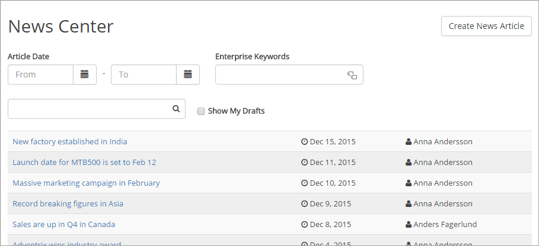
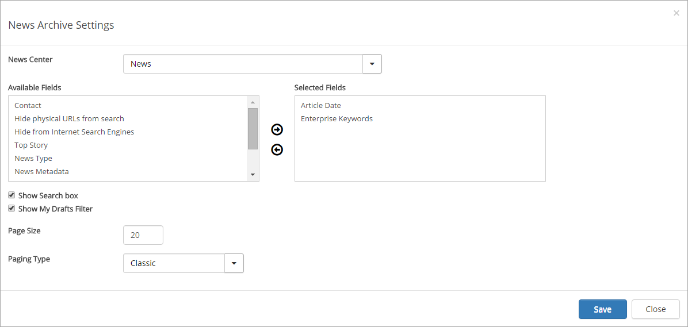

News Archive
===========================

The News Archive control makes it possible for the end user to find news articles published in a specific News Center site.

The News Archive control is deployed as part of the News Center page layout. Note: "Create News Article" is displayed for news editors only.

The following settings are available for the control:

+ **News Center**: The drop down displays all news centers deployed to the current site collection. Select the news center that should be shown in the control.
+ **Available fields/Selected Fields**: The Available Fields list displays all supported list columns (Date and Time, Person or Group, Yes/No, Managed Metadata) in the Pages library of the selected News Center site. The Selected Fields will show up as filters to the end user. It is possible to drag and drop the columns to decide in which order the columns should be rendered to the end user.
+ **Show Search Box**: Checked if the free text search box should be available.
+ **Show My Drafts Filter**: Check if it should be possible for the end user to show draft news (only relevant for news authors).
+ **Page Size**: Defines the number of news articles displayed per list page.
+ **Paging Type**: Defines what type of paging that should be used: *Classic* The result list will be divided into pages based on the Page Size. *Scroll* By default, the page will load as many news articles that can fit the screen. When the user scrolls down, the number of news articles set in Page Size will load.
  
