News Viewer
===========================

The news viewer control displays news articles from one or more News Centers, based on a configured filter.

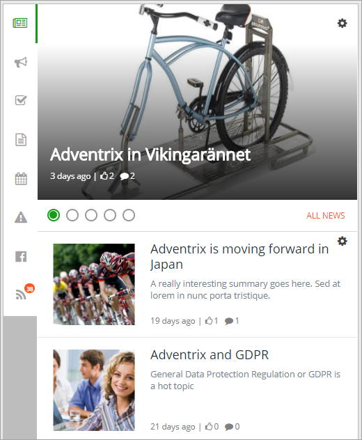

News Viewer Settings
**********************
The news viewer settings are divided into three tabs:

+ **Query Settings**: Defines which news articles to get from a specific news center.
+ **Display Settings**: Defines how to render the news articles to the end user.
+ **Custom colors**: You should primarily set colors through Theme colors in Omnia Admin but If you still would like custom colors for the control, you can set them using this tab.

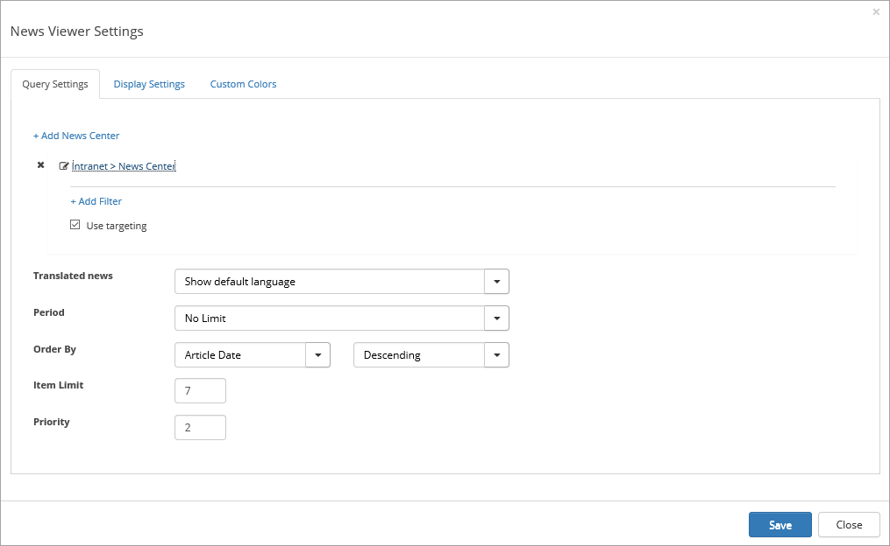

The Query tab
---------------
The **News Center** list displays all publishing sub sites in the site collection that have the "Omnia News Center" app feature activated. You can add News Centers from other Site Collections as well.

Select News Center(s) and set the settings this way:

1. Select a News Center from the list. If you want news from more than one News Center displayed in this viewer, select the others the same way.(In the image below two News Centers are selected.)
2. If not all news from the News Center should be displayed, you can set filters. Do do that, click the News Center. Filters are set indepently for each News Center.

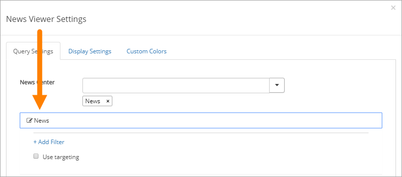

Available filters for that News Center are then shown. (What is available can differ depending on how the specific News Center is set up). 

If targeting is activated, you can now select to use it or not. If you do not select "Use targeting" all targeting settings made by the authors are ignored.

3. You can also add filters here, Click "Add Filter" to do that.

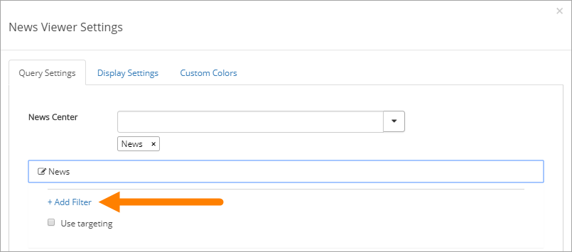

4. Select type of filter in the first field. What is displayed after that depends on that choice. If more than one filter is added to the News Viewer, the news articles must match all filters, to be included in the result.

Filters will limit the news articles shown to the end user based on certain criterias. The filters support Yes/No and Managed Metadata columns. Omnia will list all supported columns from the pages library where the news articles are located. It is possible to filter based on a fixed value or a user profile property. 
 
Some fields can be set to "Fixed value". This is displayed as a check box. If checked, only news articles that is set to Yes will be shown. If unchecked, only news articles that is set to No will be shown. An example of this is the Top Story filter.
  
Some fields can be set to "Fixed Managed Metadata value". Only one value from the term set can then be selected. If the checkbox "Include Child Terms" is checked, any child terms to the value selected will also match the filter (for example: United Kingdom is selected, this will match news articles tagged with London, Manchester and Birmingham)

A User "Profile Property" filter makes it possible to target news to a specific group of people based on their profile. When User Profile Property is selected, the value listbox will be populated with all available user profile properties in SharePoint. The News Viewer will do a string comparison between the values in the profile and the values set on the news articles. If "Include Child Terms" is checked, it will also include child terms to the terms the news article is tagged with. If "Include Empty" is selected, it will also include news articles that has not been tagged with this meta data property at all. 

**Note!**
Regardless of the filters you set here, a user can always read all news articles in the News Center.

For the following fields the settings apply for all News Centers selected here:

+ **Period**: A list of predefined values that will decide for how long news articles will be shown in th viewer. It is based on the article date. Select "No Limit" if the query should ignore date.
+ **Order By**: It is possible to select whether to sort the list by title or article date. Default is article date descending.
+ **Item Limit**: The number of news articles to show in the result can be limited to a maximum number of items.
+ **Priority**: It is common that more than one News Viewer control is added to a page. Dependant on how the different News Viewer controls are configured, a news article may end up in the result in more than one control. The priority setting makes sure that this cannot happen. The priority decides which control that will show the news article in such a case. A lower number (for example 1) takes priority over a higher number (for example 2).

**Adding a News Center from another Site Collection**
1. Click "Add News Center".
2. Activate the address field and enter the adress to a site in another Site Collection.

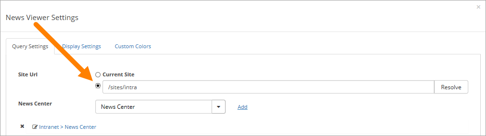

3. Click "Resolve".

News Centers in that site are now displayed in the News Center list. You select News Center and handle settings as described above.

The Display Settings tab
---------------------------
On this tab the following settings are available:

**View Template**: The view template defines how the result should be rendered on the page. There are four options:

"News Roller" view displays all articles matching the query in the same area 5 seconds at a time. The user can manually change which article that is displayed by holding the mouse over the container and click on the arrows. The image is using Image Rendition with ID 1001.

.. image:: Images/news-roller-old-ux.png

"News Listing with Image" displays the news in a list, with a landscape image to the left.

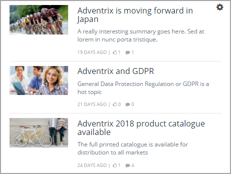

"Top Story" displays a big image with title on a transparent area. If one news article is displayed as Top Story, it will use the image with Landscape image rendition.

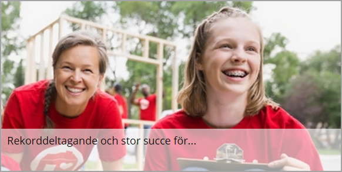

If two news articles are displayed, it will use the image with Square image rendition. If the news article does not have an image, more metadata about the news article will be shown and the background and text colors will use the [default colors](/Docs/[language]/Omnia%20Admin/default-colors/index.html).

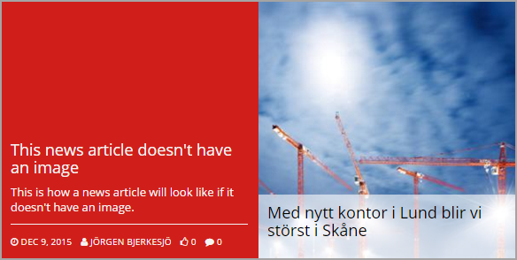

If three news articles are displayd, it will use the image with Portrait image rendition.

A "Simple List" view displays the news articles without image in a simple list.

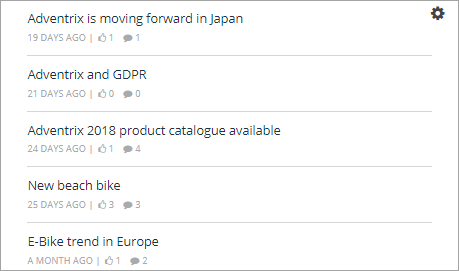

The "News Roller New UX" view displays all articles matching the query in the same area 5 seconds at a time. The user can manually change which article to displayed by clicking the buttons. The image is using Image Rendition with ID 1001.

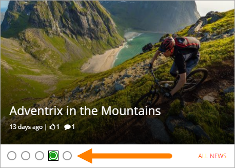

"News Listing with Image New UX" displays the news in a list, with a square image to the left.

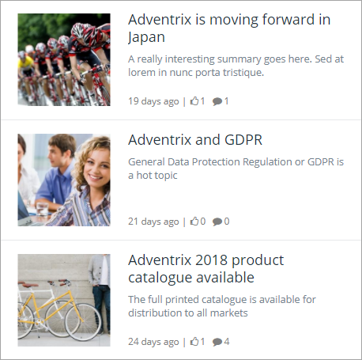

+ **Display News Center link**: Check if the link "Go to News Center" should be available at the end of the News Viewer.
+ **News Center Label**: Here you can change the label displayed for the News Center.
+ **Display no result message**: Check if a no result message should be shown if there are no news articles available in the list, for the loged in user.

If a news article has not been read by the user (it is considered read when the user has browsed to the news article page), the title will be shown in bold.

The Custom Colors tab
----------------------
You should primarily set colors through Theme colors in Omnia Admin (System/Settings/Default colors). If you still would like custom colors for the control, you can set them using this tab.

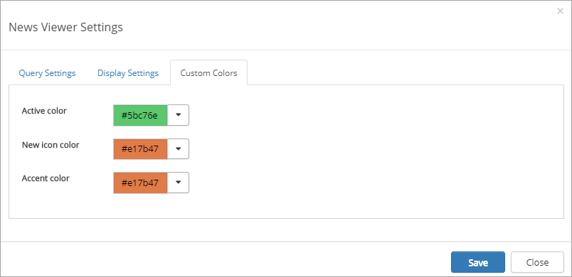

News Viewer in Notification Panel
***********************************
The News Viewer control is available in the Notification Panel. If the News Viewer is added to the panel, a notification count icon will be shown if there are news articles in the result that are new to the user (the user has not seen them in the news list before)

News Viewer Web Part/block
****************************
The News Viewer control can also be added to a legacy page as a web part or as a block to a Quick Page.

