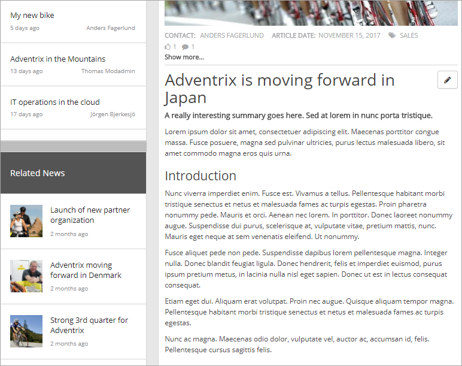
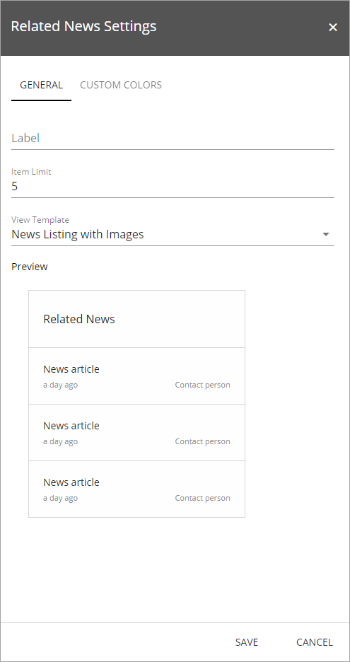
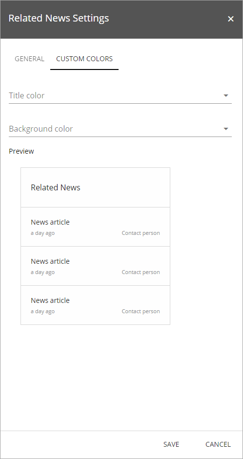

Related News
===========================

The Related News control display news articles that share any enterprise keyword with the current news article.

Here's an example:

The settings
*************
The following settings are available for the control:

The General tab
-------------------
On this tab you can set the following:

- **Label**: You can edit the heading shown for the list here.
- **Item Limit**: The maximum numbers of news articles to display in the list.
- **View Template**: Select to show the list as a news listing with images or as a simple list. See the "Preview" for a rough example.

The Custom Colors tab
----------------------
You should primarily set colors through Theme colors in Omnia Admin (System/Settings/Default colors). If you still would like custom colors for the controls heading, you can set them using this tab.

