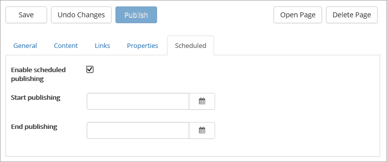
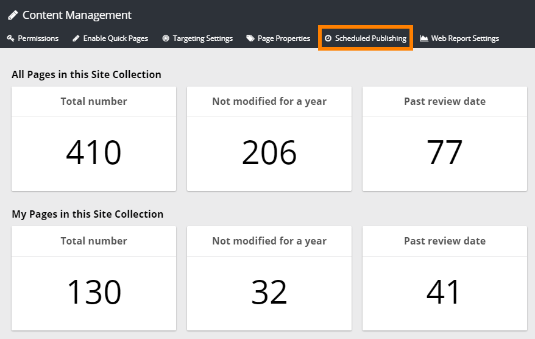

Scheduled Publishing
===========================

If Scheduling is activated for the News Site, a "Scheduled" tab is shown, to be used by news authors. Even if scheduling is activated it is up to the news author to use it or not for a specific news page.

Here's an example:

.. image:: schedule-news-2-border.png

When Scheduled is activated for a page, the "Publish" button is no longer available (it's now grey as you can see in the image below).  The news author just saves the page the normal way. Publishing takes place according to the date and time entered. Start date and time must be entered. End time is optional.

Activating Scheduled Publishing for a Site
**************************************************
Use the Omnia Admin settings for the active site collection to activate or deactivate Scheduled Publishing. It's found under "Content Management":

The settings available are these:

.. image:: scheduled-publishing-box.png

To activate, just select the box and save.

This enables Scheduled Publishing to be used by authors. It is probably most interesting for news but can be activated for any site.

