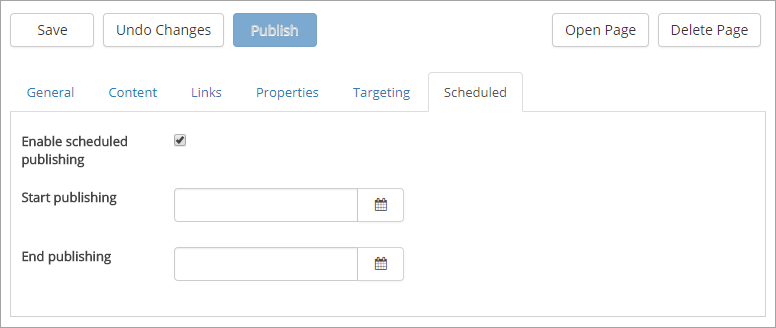

Scheduled Publishing
===========================

If Scheduling is activated for the News Site, a "Scheduled" tab is shown.

Click to enable Scheduled publishing for the news page and set start date and time and, if you wish, end date and time. If you don't set end date and time, the news page is displayed a number of days according to the default news settings. 

When you select to activate scheduled publishing for a news page the Publish button is deactivated. You just save the page the normal way. The page then is automatically published the start date and time you have set.
