Aggregated Calendar
===========================

.. toctree::
   :titlesonly:

   setup/index

The aggregated calendar control displays events from one or more calendars from any site in the tenant.

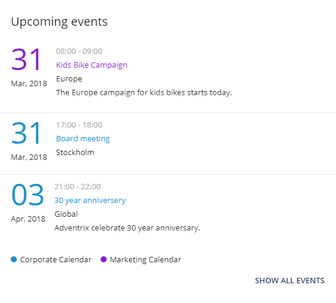

Using the option "Show all events":

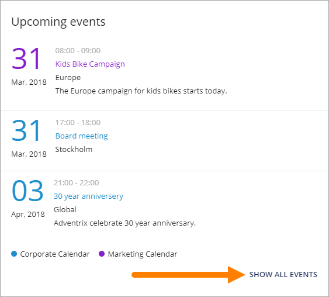

Users can access and browse the whole aggregated calendar. It can look like this:

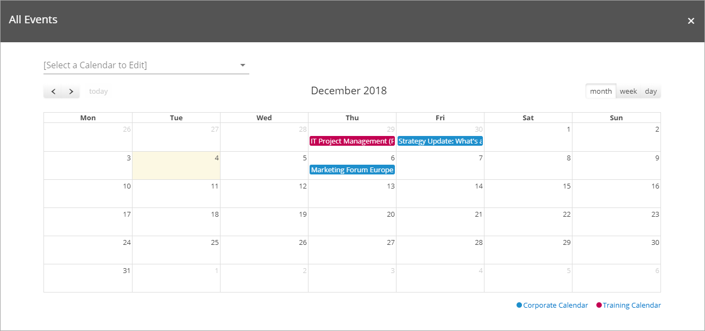

Settings for the control
*************************
The following settings are available:

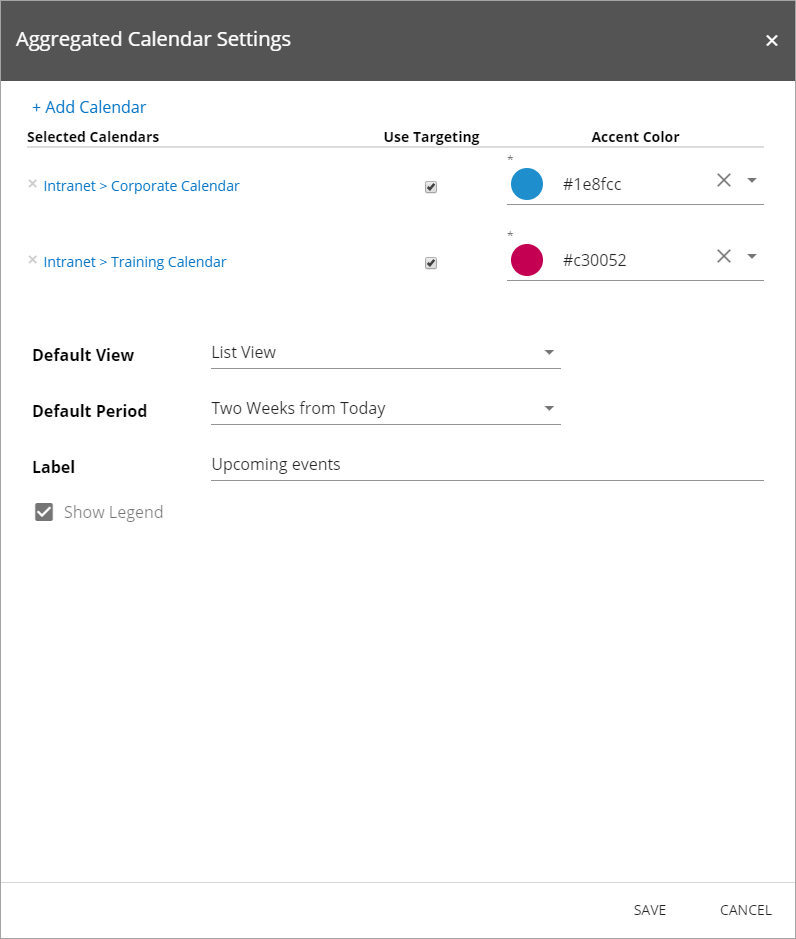

+ **Add Calendar**: To display events in the aggregated calendar control, at least one calendar needs to be added. See more information below.
+ **Use Targeting**: If targeting should be used for the calendar, select ths box. Targeting has to be set up in Omnia Admin. It's the same settings for all controls that can use targering. 
+ **Accent Color**: Defines the color for some objects, for example date and event name. Another color can be selected from the list.
+ **Default Period**: Defines periods for the events to be displayed. 
+ **Label**: Label to be shown for the control.
+ **Default View**: Defines how to show the events. Note! Not all views are suitable for all periods, for example it only makes sense to display the Current Month events for the Month View.
+ **Show Legend**: If legends for the calendars should be visible, select this box. (The two images at the top has this option activated).
+ **Visible**: Defines when the control (the calendars) should be visible: Always, up to a maximum width or to a minimum width. Then define maximum or minimum width in pixels.

Add a calendar
***************
Follow these steps to add a new calendar:

1. Click "+ Add calendar".

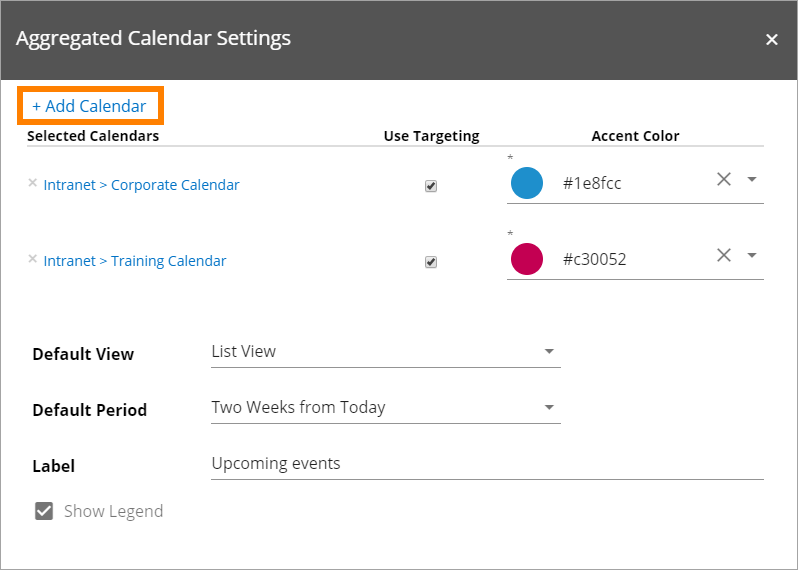

You can now add calendars from the current site (default) or from any other site in the tenant.

To add calendar from the current site:

1. Open the list "Calendar" and select calendar.
2. Click "Add".

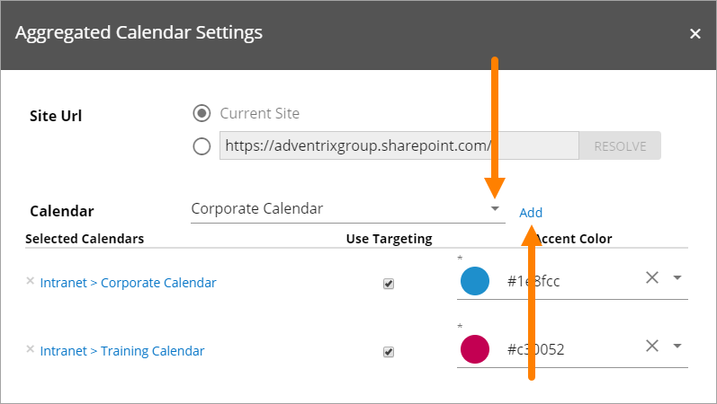

To add a calendar from another site:

1. Active the text box.
2. Enter the url to the site where the calendar is located and click "Resolve".

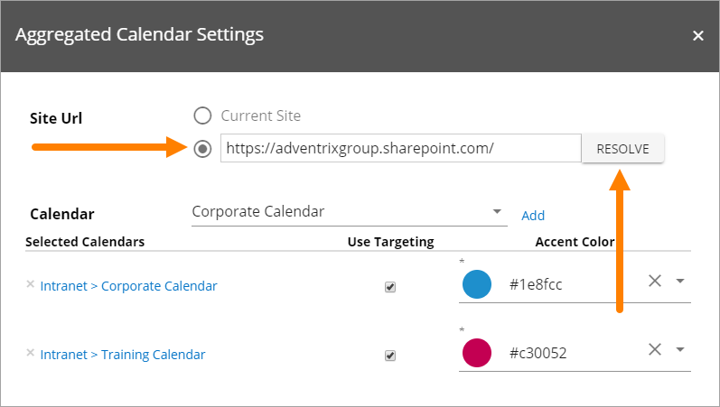

3. Open the list "Calendar" and select calendar. (If no calendars are found a message will be shown.)
5. Click "Add".

All selected calendars are shown at the top, just under "Query Settings".

Remove a calendar
*******************
To remove a calendar just:

1. Click the x for the calendar in the list of active calendars.

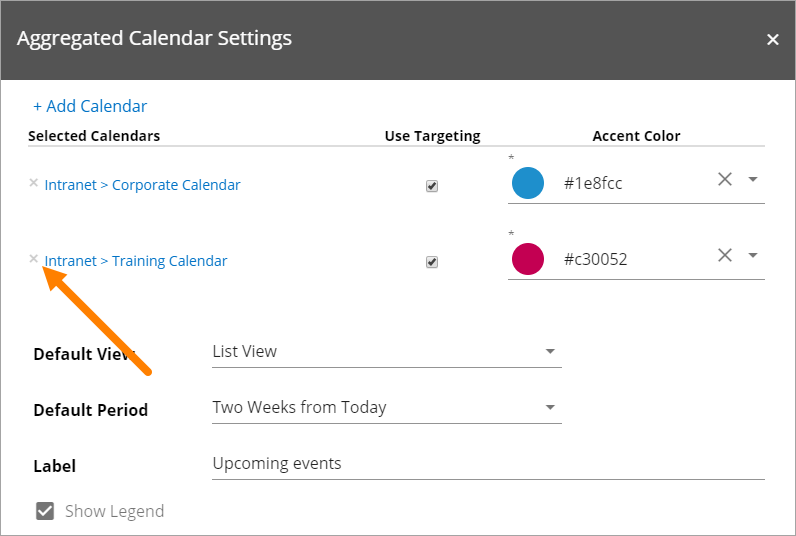

Edit a calendar
****************
If you have permissions to edit a calendar, you can do that by clicking the button in the control:

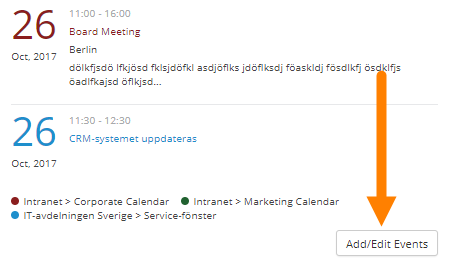

Select the calendar in the list and edit or add events as needed.

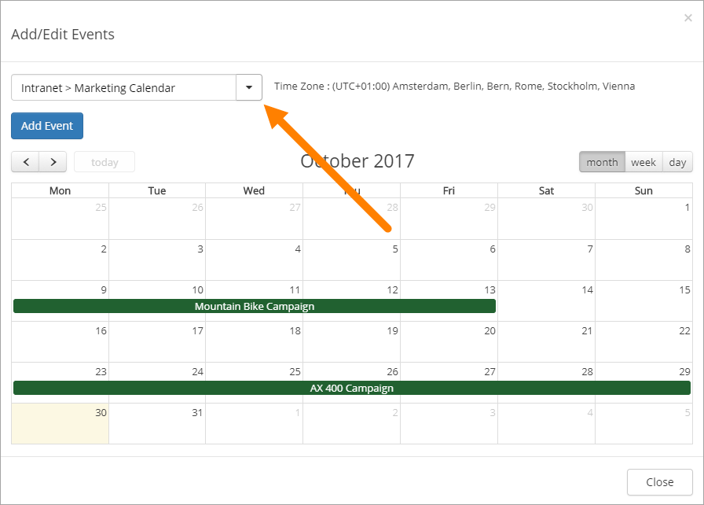

More on Default views
***********************
The list view displays all events from the selected default period in a list. It is the preferred view if you want to focus on upcoming events. (See the image at the top of the page.)

The Month Calendar view displays all events from the selected default period in a monthly calendar. It is possible to navigate from month to month using the navigation arrows at the top. The current day will be shown with a different background color. The user can hover over an event to show detailed information about it.

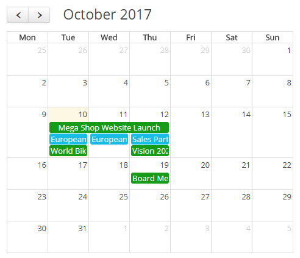

The Week Calendar view displays all events from the selected default period in a weekly calendar. It is possible to navigate from week to week using the navigation arrows at the top. The current day will be shown with a different background color. The user can hover over an event to show detailed information about it.

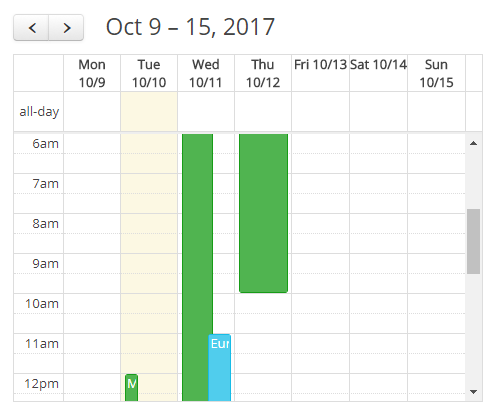

Aggregated Calendar in Notification Panel
******************************************
The Aggregated Calendar control is available in the Notification Panel. If the Aggregated Calendar is added to the panel, a notification count icon will be shown if there are events in the default view, that are new to the user. 

Aggregated Calendar block and Web Part
***************************************
The Aggregated Calendar control can also be added to a Quick Page as a block and to a legacy page as a web part.

