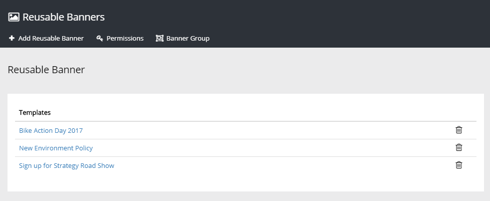
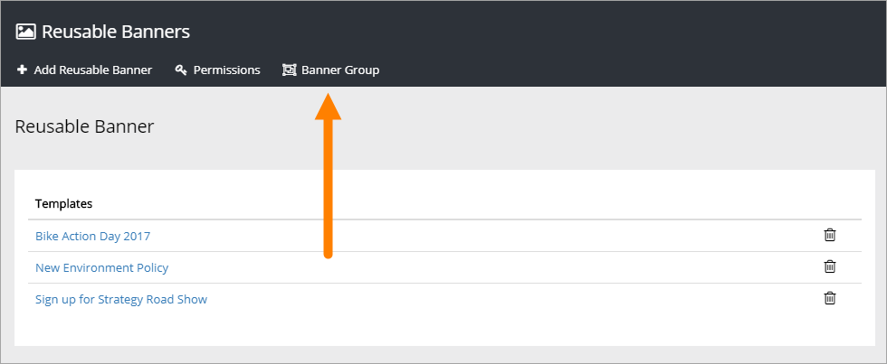
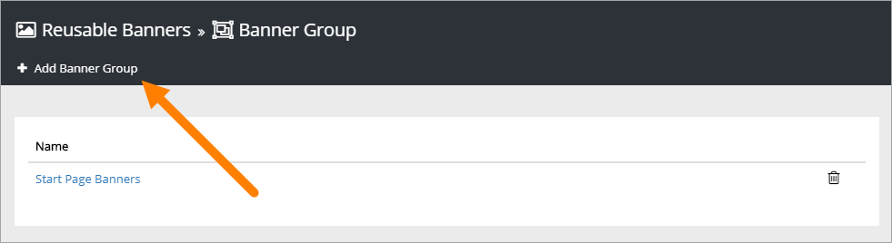
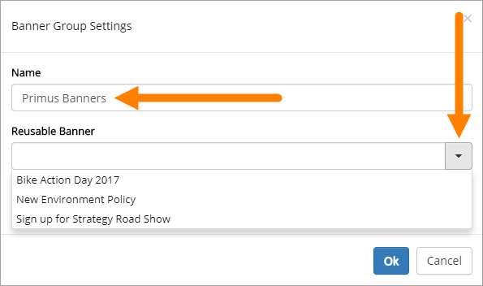
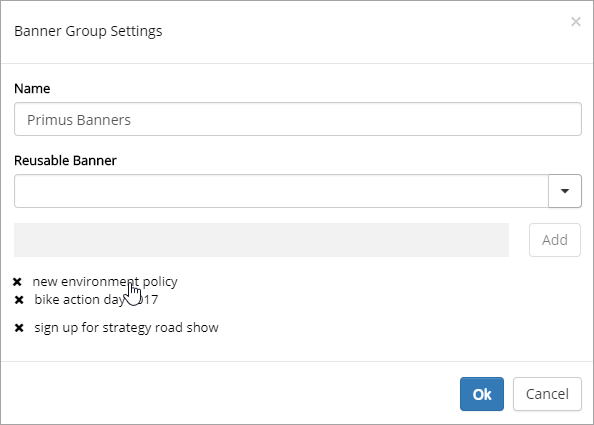
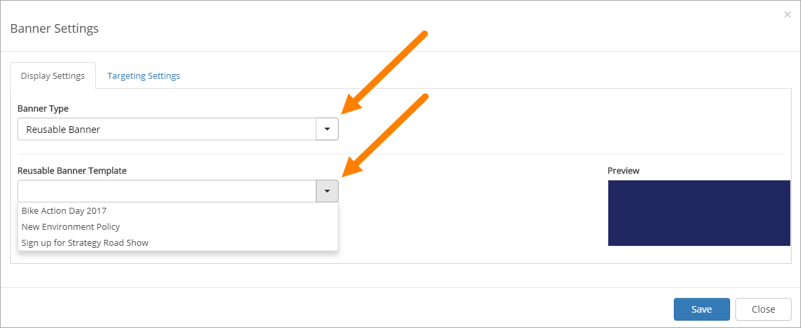
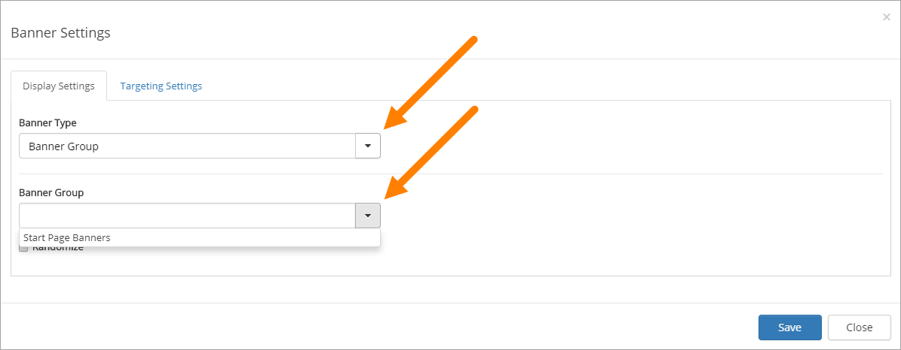
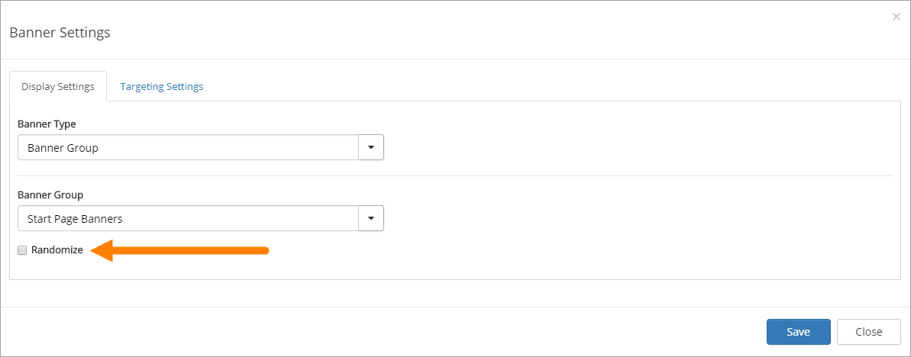
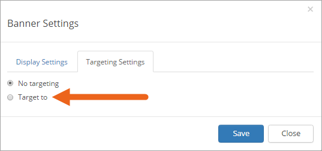
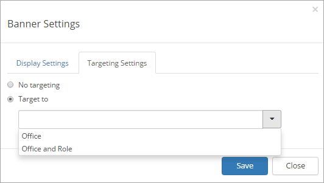

Banners
===========================

A banner can either be centrally managed that can and reused on several web pages (Reusable Banner or a Banner Group) or created "locally" through the Banner Control.

Reusable Banners
******************
Reusable banners are created by an administrator and are avilable for editors to use on any publishing page. Reusable banners can also be grouped to a Banner Group. An editor can only add a reusable banner or a banners group to a page. The editor can not edit such banners in any way.

**Note!**
If a reusable banner should be targeted, that has to be done by an editor when the banner is added to a page.

If additional users should be able to create reusable banners, use the "Permissions" option.

Creating a reusable banner works the same way as creating a custom (local) banner, see below.

There is just one extra field. A reusable banner must have a name.

Banner groups
----------------
Reusable banners can be grouped. When displayed on a page the banners in the group will alternate every time the user enters the page or refreshes the page. Per default, the banners alternate in the order they are set up, but a page editor can choose to randomize.

To create a banner group, do the following:

1. Se too that all reusable banners for the group are created.
2. Select "Banner Group".

3. Click "Add banner group".

4. Add a name for the group.
5. Open the list of reusable banners and select the banners for the group, one efter another.

The order in which the banners will alternate is from top to bottom, if the editor does not select "Randomize" when adding the banner group to a page. If you would like to change the order, use drag and drop.

The Banner Control
**********************
Through the Banner control a web editor can add banners on a web page.

The control can be used add centraly handled banners to a page, or for "local" banners, created and edited on a specific web page.

The first step is always to add a web part to a legacy page or a block to a Quick Page, for the control.

Here's how to add a web part to a legacy page:

1. Go to the page.
2. Edit the page in advanced mode.
3. Add the web part to a suitable web part zone. The web part is called "Banner" and is found in the "Omnia" Category.
4. Check in the page. (You must do that to be able to access the settings.)

Here's how to add a block to a Quick Page:

1. Go to the page.
2. Click Show/hide edit icons.
3. Add the block to a suitable area. The block is called "Banner" and is found under Omnia.Intranet.

To access the settings for the control, show the edit icons and click the settings gear for the control.

This will open the settings dialog.

Adding a reusable banner
--------------------------
The default banner type is a custom banner used only on the current web page. If you want to use a centrally managed, reusable banner, select "Reusable Banner". This will display all available reusable banners in the list.

Select the reusable banner that you would like to show on the page.

You can't edit the banner itself. You can just add a reusable banner to the page. 

Adding a banner group
**********************
If banner groups are set up in Omnia Admin, you can add a banner group to the page. In a banner group, the banners will alternate every time a user enters or refreshes the page.

Select the banner group that you would like to show on the page.

You can't edit the banner group here. You can just add a banner group to the page. But you can choose that the banners in the group will be shown randomized (if not selected, the banners will alternate in the order they are set up).

Creating a custom banner
-------------------------
To create a custom, local banner, select "Banner" and use the following settings:

+ **View Template**: Defines how the banner should be structured:
  + *Image On Top*: Displays a big image at the top, above title, description and footer. Best suitable for landscape images.
  + *Title and description on image*: The image covers the whole banner area, title and description are placed as an overlay.
  + *Title on image*: A variant of the above, in this case only the title is placed as an overlay.
  + *Image On Right*: Diplays a small image to the right and the title, description and footer floating to the left of the image. Best suitable for portrait images.
+ **Link Url**: The url to open when the user clicks the banner.
+ **Open In New Window**: Defines whether the url should be opened in a new window or not.
+ **Pick link in advanced mode**: Click on this link to select a page or document in the current site collection, for the Link Url, using a link picker.
+ **Image and Background Color**: Select the image and background color that should be used by the banner.
+ **Title and Color**: Enter a banner title and a text color.
+ **Content and Color**: Enter the banner text and a text color.
+ **Footer**: If needed, add a footer to the banner and text color, that will be rendered below the content.

Targeting banners
-------------------
A banner can be targeted to any receivers that has been defined in Target Definitions. A targeted banner is only displayed to that group. No one else will see it. It works the same for Reusable banners and Custom banners.

For more information on Targeting Definitions, see:

.. image:: targeting-definitions/index.html

To target a banner, do the following:

1. Add the banner, either a reusable banner, a banner group or a custom banner, as stated above.
2. Click the tab "Targeting settings".
3. Select "Target to".

 
3. Open the list and select target.

Banner in Notification Panel
--------------------------------
It is possible to add a Banner control to the notification panel. Note! The Banner control is mainly used in the notification panel category together with another control that will generate the business logic for the notification count icon. The Banner control doesn't generate a notification count.
