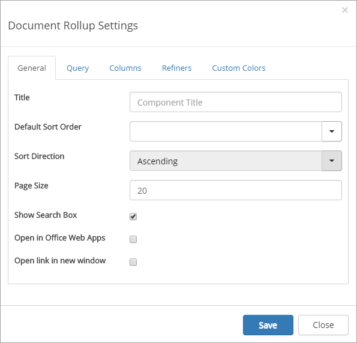
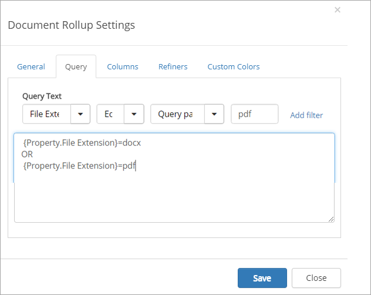
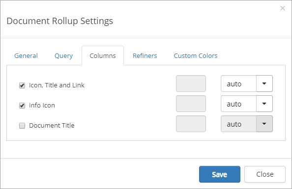
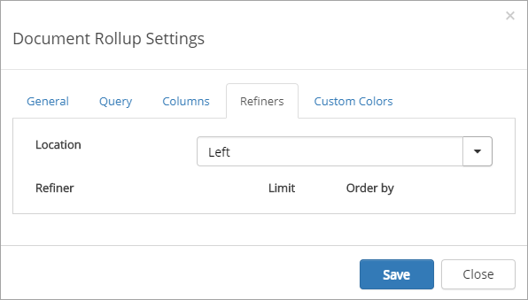
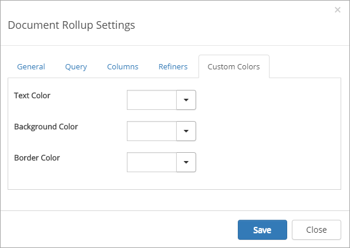

Document Rollup
===========================

You can use this control on any page, both legacy pages and Quick Pages, and even in a team site. Use it to display selected documents available within the site. Reading permissions apply for the users regardless of the settings in the control.

**Note!**
If Omnia Document Management is installed, and the purpose is to display Controlled Documents, don't use this control, use the "View Controlled Documents" control instead.

Here's an example of a document list created with the Document Rollup control:

.. image:: document-rollup-example.png

Settings for the control
*************************
The following settings are available for the control:

The General tab
-----------------
On the General tab, the following settings are available:

+ **Heading**: Here you can change the heading shown for the control.
+ **Default Sort Order**: Select sort order. What sort orders are available can differ depending on the Content Managment Properties for the site.
+ **Sort Direction**: Select Ascending or Descending sorting.
+ **Page Size**: Defines the number of objects to display per list "page".
+ **Show Search Box**: Select if it should be possible to search the list (and then you must of course have a Search Box).
+ **Open in Office Web Apps**: Select if documents should be opened in Office Web Apps or in locally installed applications (which in some cases, for example for PDF:s, will result in a download).
+ **Open link in new window**: If you would the document to be opened in a new window, check this box.

The Query tab
---------------
Here you add queries, which is the detailed "settings" for what to display in the list, this way:

1. Select settings for the query, and click "Add filter".

Here's an example of a query for displaying pdf:s in the list (docx already added). You can see the actual queries in the field below, which was added when clicking " Add filter".

The Columns tab
------------------
Here you decide what to show in the list:

To the right you can choose width for each selected column: auto, as a percentage or fixed pixel width.

The Refiners tab
-----------------
Here you select refiners to show for the list:

+ **Location**: Select the placement of the refiners: Top, Left or Right.
+ **Refiner**: Activate available refiners here.
+ **Limit**: Set the number of values for the refiner to be displayed. If there's more a "Show more" link is displayed.
+ **Order by**: Set the sorter order for the values. Can be either alphabetical order (default) or by Count (number of documents).

The Custom Colors tab
----------------------
You should primarily set colors through Theme colors in Omnia Admin (System/Settings/Default colors). If you still would like custom colors for the control, you can set them using this tab.

