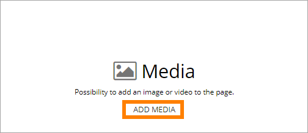
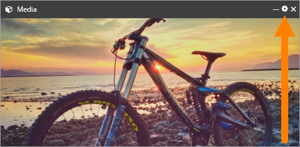

Media Block
================

Use the Media block to add an image or a video anywhere on a page. The following file types can be used for images: tiff, pjp, pjpeg, jfif, tif, gif, svg, bmp, png, jpeg, svgz, jpg, webp, ico, xbm, dib.

Add an image or a video
************************
When you have added the block to a page you can click ADD MEDIA:

You can then use the Media Picker to add an image or a video. See this page for more information about the Media Picker: :doc:`Media Picker </web-content-management/web-pages/media-picker/index>`

When you edit a page with an image or a video, you click the cog wheel to access the Media Picker for changes or to replace the image or video:

Settings
*********
The settings for the block are those available in the Media Picker, there's not other settings.

