Quick Poll
===========================

.. toctree::
   :titlesonly:

   setup/index

Through the Quick Poll control a web editor can add a poll on a web page (the questions are created in Omnia Admin, see Quick Polls Administration, below). Quick Polls can be added as a web part to any standard Sharepoint page and as a block to any Quick Page.

Here's an example on how an end users would see a Quick Poll:

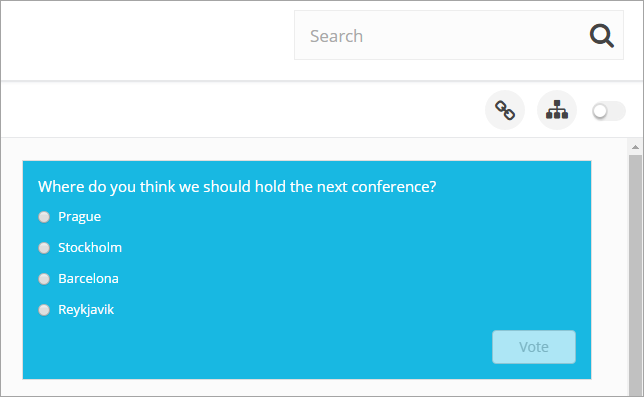

**Note!** As usual you must publish the page for any changes to be shown for the users.

When a user has voted, the present result is shown, for example:

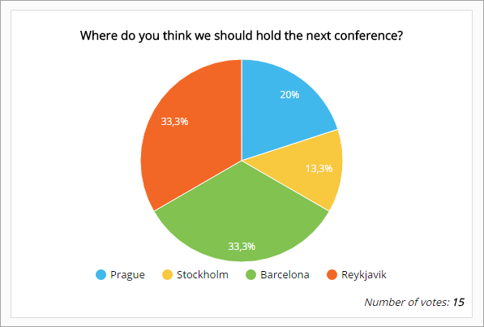

**Note!** Whether a user has answered the poll or not is stored as a cookie in the web browser. If another web browser is used or the cookies are cleared, the user will be able to vote again.

Quick Polls Administrattion
*****************************
You use this option in Omnia Admin to create the polls and then any editor can place any active poll on the start page or on any web page in the intranet.

An administrator, and others that are assigned the permissions, can create Quick Polls. Any editor for publishing pages can then add a Quick Poll (or several) to any publisning page. Quick Polls can of course also be added on the start page.

.. image:: quick-polls-admin.png

Create a new Quick Poll
-------------------------

+ Click "Add Quick Poll".

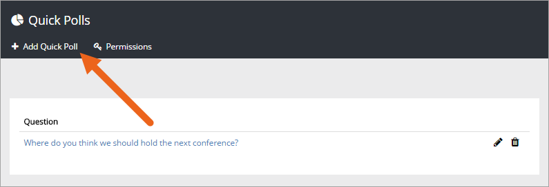

Use the following settings:

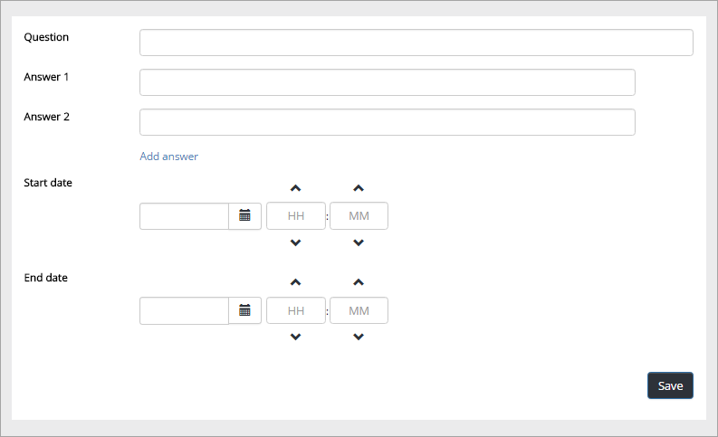

+ **Question**: Add the question here.
+ **Answers**: Add two or more answers to choose from. The default is two answers. Click "Add answer" to add more answer fields.
+ **Start date**: Select start date and time för the poll.
+ **End date**: Select end date and time for the poll.

**Note!** The Quick Poll must be active to be added to a page - withing the start- and end date. If an editor tries to add a poll that is not active, an error message is shown.

Don't forget to save when your done.

Edit or delete polls
---------------------
Use the icons in the list to edit or delete a poll:

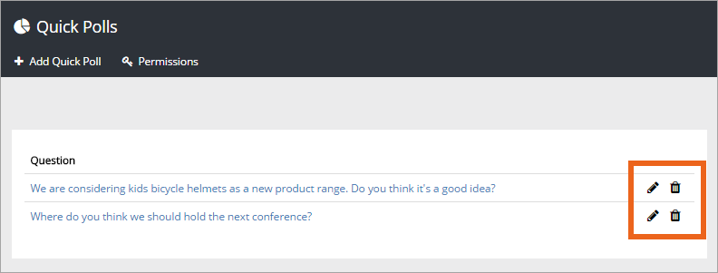

Adding Quick Polls administrators
----------------------------------
If other colleagues should be able to create Quick Polls, you add them to the permissions list here:

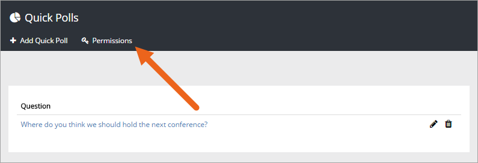

Quick Polls results
-----------------------
See a Quick Poll's results by clicking the link in the list. The result is shown this way:

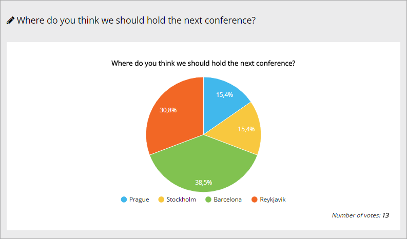
 
The settings for the control
*****************************
The following settings are available when the control has been added to a page:

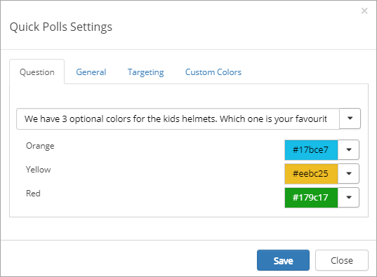

The Question tab
------------------
On this tab you select question.

+ **Question**: Open the list and select which Quick Poll to display.
+ **Display settings**: You should primarily set colors through Theme colors in Omnia Admin, but if needed you can set background color, link color and border color here or on the "Custom colors" tab. 

The selected poll must be available (start date and time, and end date and time), If it's not available, the message "The selected poll is not active" is shown. You then have to select another poll, or have a talk with the administrator to change start- or end time for the poll yopu would like to display.

The General tab
-----------------
On this tab you set the position for the explanation of the result (the Legend). You can also chosse "None" to not display the explanation.

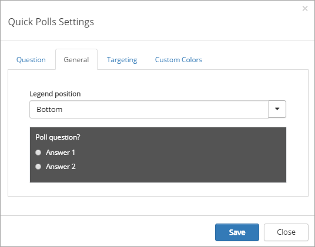

In the example above (Where do you think we should hold the next conference) the Legend is placed at the bottom.

The Targeting tab
-------------------
If targeting is activated (in Omnia Admin), you can select to use targeting for this poll.

Select "Target to" and choose target group in the list.

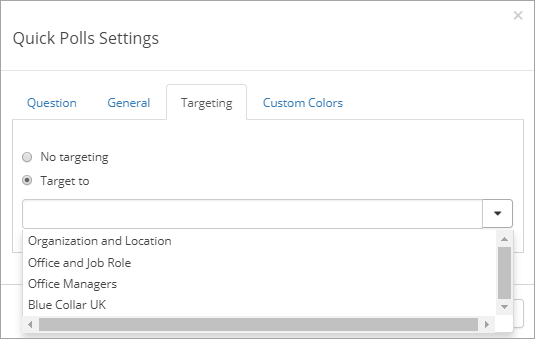

The Custom Colors tab
--------------------------
You should primarily set colors through Theme colors in Omnia Admin (System/Settings/Default colors). If you still would like custom colors for the control, you can set them using this tab.

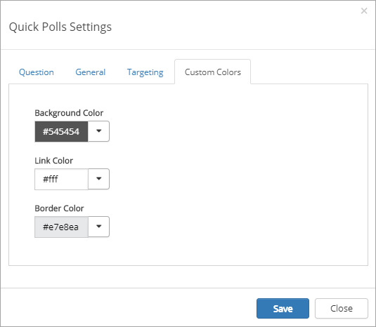

