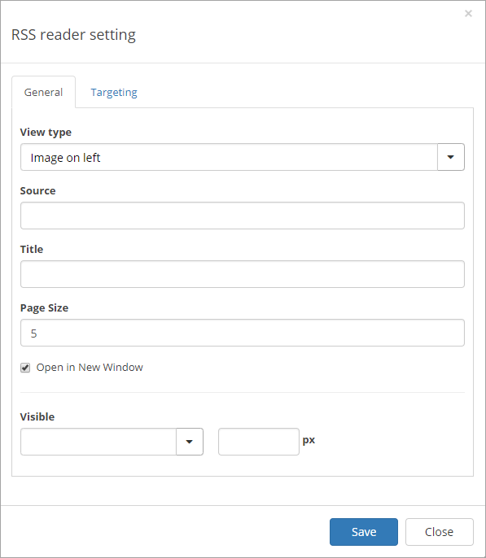
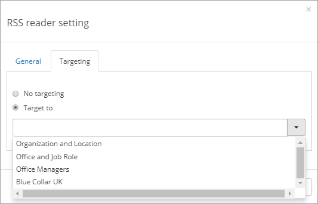

RSS Reader
===========================

.. toctree::
   :titlesonly:

   setup/index

The tenant feature Omnia Intranet RSS Reader must be activated for the RSS Reader control to be available.

The Omnia RSS Reader is available as a web part for standard Sharepoint pages and as a block for Quick Pages.

Settings for the control
*************************
Here you can set the following:

The General tab
------------------
On this tab you can set the following:

+ **View type**: Select to show the list image to the left, image to the right or no image.
+ **Source** Add the address to the RSS source here.
+ **Title**: You can edit the heading shown for the list here.
+ **Page Size**: Defines the number of objects to display per list "page".
+ **Visible**: Defines when the control should be visible: Always, up to a maximum width or to a minimum width. Then define maximum or minimum width in pixels.

The Targeting tab
-------------------
If targeting is activated, you can select to use targeting for the RSS Reader.

Select "Target to" and choose target group in the list.

