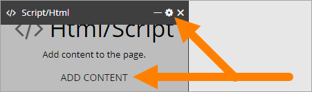
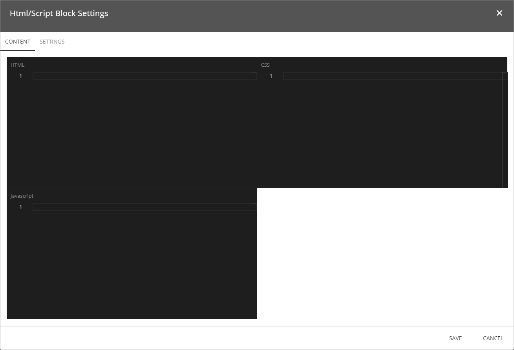
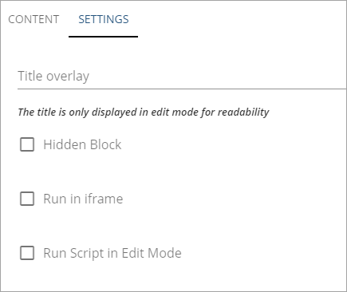

Script/HTML
===========================

Script/HTML is a block you can use for various applications to add extra functionality or content to a page. One example is to add the code for a video, from YouTube, or some other source.

To add content (HTML) or edit the settings, you can either click the cogwheel or click "Add Content".

The following is shown:

Use the desigated areas for:

+ **HTML**: Add HTML here.
+ **CSS**: To set CSS for the content in this field, add it here.
+ **Javascript**: If Javascript is needed/used, add it here.

The settings
*************
The following settings are available for the block:

+ **Title Overlay**: If a Title Overlay is needed, add it in this field. (Note the comment: "The title is only displayed in edit mode for readability".)
+ **Hidden block**: If the block for some reason should be hidden in reader mode (end user mode), select this option.
+ **Run in iFrame**: If the HTML/Script you add here should be run in iFrame, select this option.
+ **Run Script in Edit Mode**: If the script should be run in reader mode (end user mode) only, select this option.

Don't forget to save when you're done.
