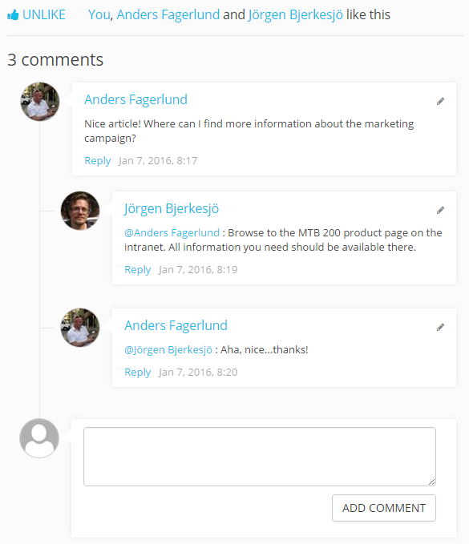
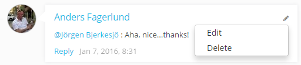
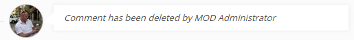
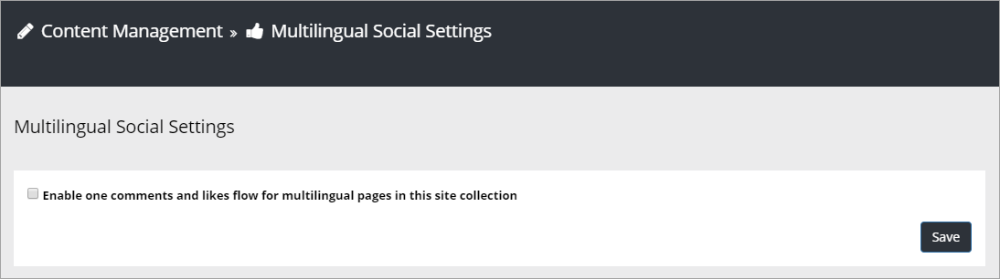

Comments and Likes
==================

**Prerequisites**: The Omnia.Intranet extension needs to be installed and the tenant feature Omnia Intranet Social Core needs to be activated.

When the feature "Omnia Intranet Social" is activated for a site, the control "Likes and Comments" becomes available on that site. The most common use is in a News Center, but the feature can be activated for any publishing site.

The control makes it possible for the end user to like and comment a specific web page. It is also possible to reply to comments. 

It is possible for the end user to edit and delete a comment, made by the user, by clicking the edit pencil icon. 

When a comment is deleted it works this way: If there are now answers to the comment it will just be removed. If there are answers, the  comment will be replaced with a text that states that it has been deleted and by whom. Everyone can delete their own comments. A Site Collection administrator can delete any comment. 

To change the settings for the control, activate the edit switch and click  the settings gear.

This will open the settings dialog.

.. image::commentsandlikessettings.png

- **Enable Likes**: Defines whether it should be possible for the end user to use Likes in the site or not.
- **Enable Comments**: Defines whether it should be possible for the end user to use comments in the site or not.

Comments and multilingual sites
********************************
The default setting is that comments are visible per language only, English comments on English pages only, Swedish comments on Swedish pages only, and so fort, but it's possible to set that all comments should be shown an all pages, regardless of language set for the page. The setting is done in Omnia Admin under Content Management/Multilingual Social Settings.

The setting is valid for the whole site collection.

More on Likes and Comments
***************************
Users can like comments as well as pages.

A user can click the hand to see a list of the users that has liked the page or comment.

A user writing a comment can use mentions to send a message to someone, for example the author of the page (news page or other). 

Note!
Likes on comments does not affect trending in any way.

