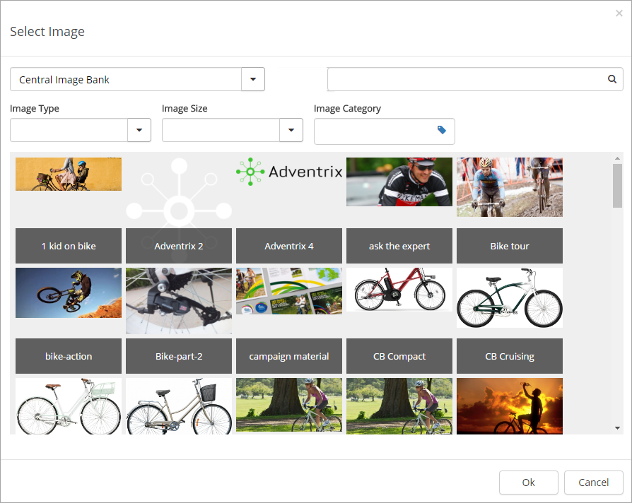
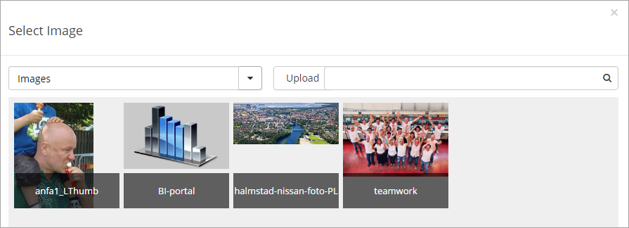
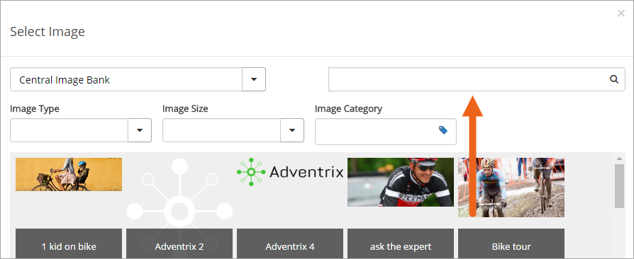
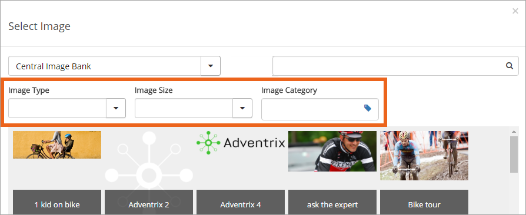
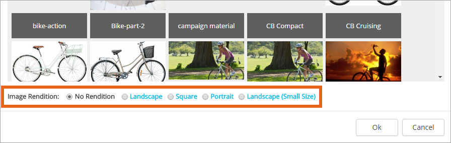
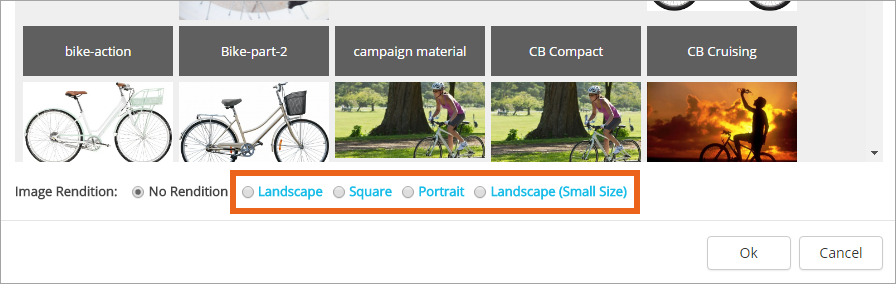

Image Picker
===========================

When browsing for an image using Quick Edit (for publishing pages and news article pages), you use the Omnia Image Picker. Here's an example:

Start by selecting an image library. Normally there are one or more central image banks available, and one local image library. The local library is most often calles just "Images".

You can't upload images to a central image bank, if you don't have appropriate administrator permissions, but you can to the local image library. When you are allowed to upload images, an "Upload" button is shown, for example:

Click the button to uplopad any image from your computer. After you have uploaded, you can insert the image on the page.

Use the top right field to search for images in the selected image bank or library.

There can be some metadata fields (Properties) available for filtering. In this example, Image Type, Image Size and Image Category is available.

Open the list or click the button (depending on type of field) and select filter. 

Choosing Image Rendition
*************************
When you have selected an image to insert on the page you can choose Image Rendition, for example:

If you are inserting a page image (to the "Image" field in the "General" tab), normally "No Rendition" or "Landscape", is the right choice.

When you have chosen an Image Rendition, keep an eye on the image. The image is always shown in the chosen rendition.

Note! Not all renditions are available in all image libraries.

Changing what part of the image to display
-------------------------------------------
For the images (rather the image libraries) where you have the appropriate permissions, you can choose what part of the image to display, when you have chosen an Image Rendition. To do that, click the link for the rendition:

Use the selection at the top to decide what part of the image to display. You can move and change the size od the selection. Click "Save" to save your changes. Then click "OK" to close Image Rendition and go back to the image picker.

Note! Just one Image Rendition selection can exist for an image in a certain image library or folder. If several editors are using the same image bank or image library, you have to decide what Image Rendition selections to use. If one editor changes an Image Rendition selection, it is changed everywhere that image is used. 

