Manage Content
===========================

In Omnia there are two different ways of editing publishing pages: The Sharepoint way and the Omnia way (Quick Edit). The Omnia Quick Edit makes it a lot easier for an editor to edit an existing page, and to create, move and remove pages. In this chapter the Quick Edit option will be described.

There's also a number of settings for Content Management in Omnia, see:

[Settings for Content Management](/Docs/en-us/omnia-intranet-admin/publishing/index.html)

Omnia Quick Edit can be started for a publishing page this way: 

+ Browse to a web page and click on the Quick Edit icon next to the page title. 

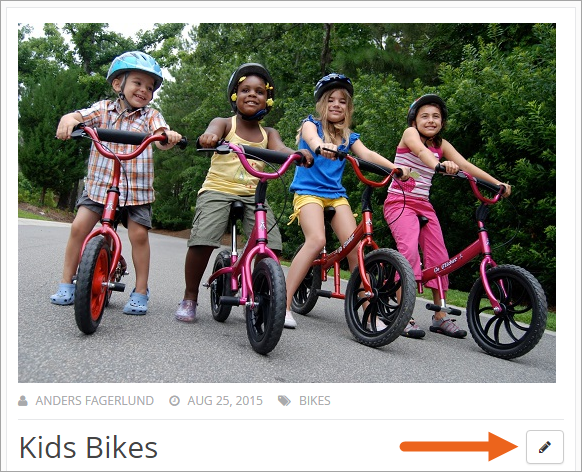

The Quick Edit button is always available for any user that has permissions to edit a certain page, regardless if the "Show/hide edit icons" are on or off.

When the icon is used to open Quick Edit for a page, that page is automatically checked out, which means no other editor can edit that page until it's checked in or published.

Tip:
If you just would like to have a look at the settings for a page, without checking out, open the Settings menu (the cogwheel) and select "Manage Content", to open the Quick edit.

Please find information about the following areas below:

+ [Add Page](#addpage)
+ [Sort Page](#sortpage)
+ [General Tab](#generaltab)
+ [Content Tab](#contenttab)
+ [Links Tab](#linkstab)
+ [Properties Tab](#propertiestab)
+ [Navigation Tab](#navigationtab)
+ [Site Tab](#sitetab)
+ [Edit > Save > Publish](#editsavepublish)
+ [Move Page](#movepage)
+ [Permissions](#permissions)

Add Page 
******************************
To add a new page in the navigation structure, browse to the location where you want to add the page and click on the plus icon.

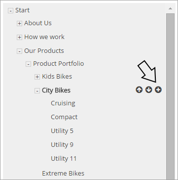

A dialog will now open. You are able to create a new page in three different ways:

+ Add simple page
+ Add page and break permission inheritance (advanced settings)
+ Add link to page

Add simple page
-----------------
When you choose to add a simple page, the following is shown:

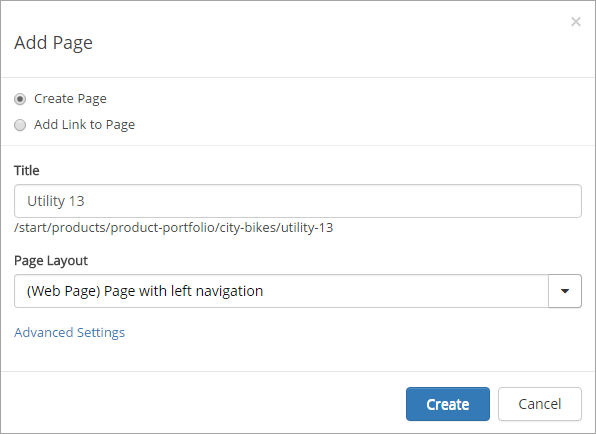

+ **Title**: The title will be used in the current navigation and as the heading for the page.
+ **Page layout**: Select one the page layouts available. 

For a "simple" page, no more settings are needed.

Advanced settings
******************
To add a page and break permission inheritance, you use the advanced settings. This is useful for example if a number of publishing pages should be edited by another group of editors, or if a number of pages should have other properties. An example could be that a publishing site contains product information that just certain editors should have permission to edit, or that just dedicated editors should have permission to edit pages with HR information. Such pages could also very well need other properties.

.. image:: addpage3.png

+ **Publishing site**: Select which site to place the page in.
+ **Create new site**: Select to create a new publishing site, to place the page in. A number of options are displayed. Add a title, a Url (The system will automatically add the prefix /publishing-). Then select an existing SharePoint permission group for editors, or create a new group. If you create a new group, you need to go to the new page and add editors to the permission group. 

If you create a new site, separate libraries and other resources will automatically be created for that site, for example a Documents library and an Image library.

Add link to page
******************
If you want to structure the navigation some special way, or if you want to add links to pages in other places in the publishing site for easy access, use "Add link to page".

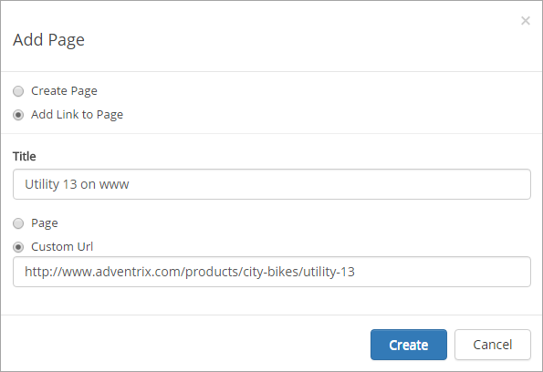

+ **Title**: The title will be used in the current navigation.
+ **Page**: Select to add a link to a page that already exists in the navigation structure, then browse to the page. 
+ **Custom Url**: Select to add a link that is not in the navigation structure. You have to manually add the Url.
A new navigation term will now be created that will either point to an existing physical page in the system (term-driven page) or point to a static link.

Sort Page 
--------------------------------
Use the up and down arrows to decide the internal sort order of the pages in the navigation.

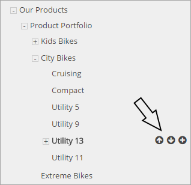

General Tab 
------------------------------------
The general tab has three fields:

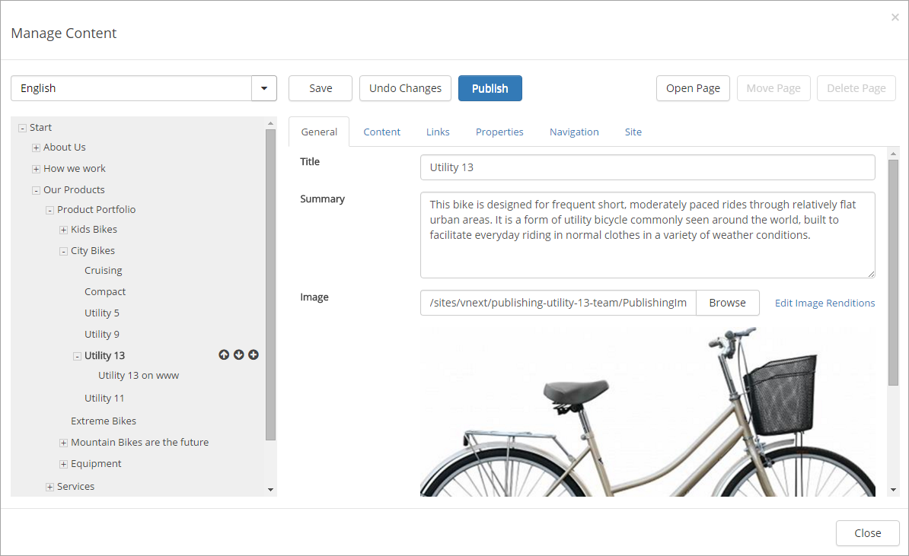

+ **Title**: This is a required field and sets the title of the page. (If this is a term-driven page it will set the term title. If it is a physical page, it will set the Title field of the aspx page.)
+ **Summary**: This text will be shown below the title on the page. (If this is a term-driven page, it will set the term description. If it is a physical page, it will set the Comments field on the aspx page.)
+ **Image**: Browse for an image using the built-in asset picker in SharePoint or enter a url to an external image. The image will be shown on top of the page. Leave blank, if the title should appear on top instead. If the image is internal (stored in the current site collection), a link will appear with the possibility to edit image renditions. Note! The system will automatically add "?RenditionID=1001" to the url when you pick an image using the Browse button. Remove this query string if you want to render the image in original format.
+ **Enable legacy web parts** If Quick Pages is activated, this check box is displayed. Quick Pages loads much, much faster, but legacy web parts can't be used on such pages. If you are about to add a banner or a quick poll to a page, you must see to that this check box is checked.

Content Tab 
*************************************
The content tab includes a content editor based on [TinyMCE](https://www.tinymce.com). Click "Edit in Advanced Mode" to use SharePoint content editing instead. Note! If Quick Pages has been activated, Advanced mode is not available.

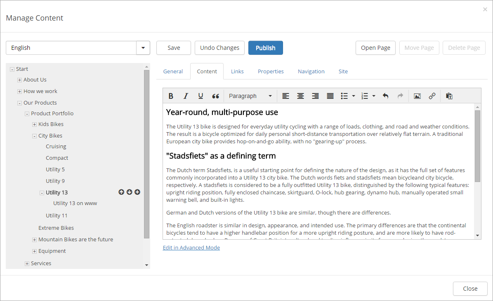

Links Tab 
***********************************
Using the links tab you can create structured links that will appear on the right-hand side of a page. Four different types of items can be added to the list of links:

+ Page
+ Document
+ Custom Link
+ Heading

A custom link can be created to anything you can reach through an Url. Headings are use to create sections in a longer link list.

Sort the links
------------------
You can sort the links and headings in the list by using drag and drop.

Edit links
--------------
You can edit any item in the list by selecting it in the list.

Properties Tab 
*******************************************
The properties tab displays all page properties that have been configured as editable for the current publishing site. The available properties are configured by an administrator in the [publishing feature in Omnia Admin](../omnia-intranet-admin/publishing/index.html).

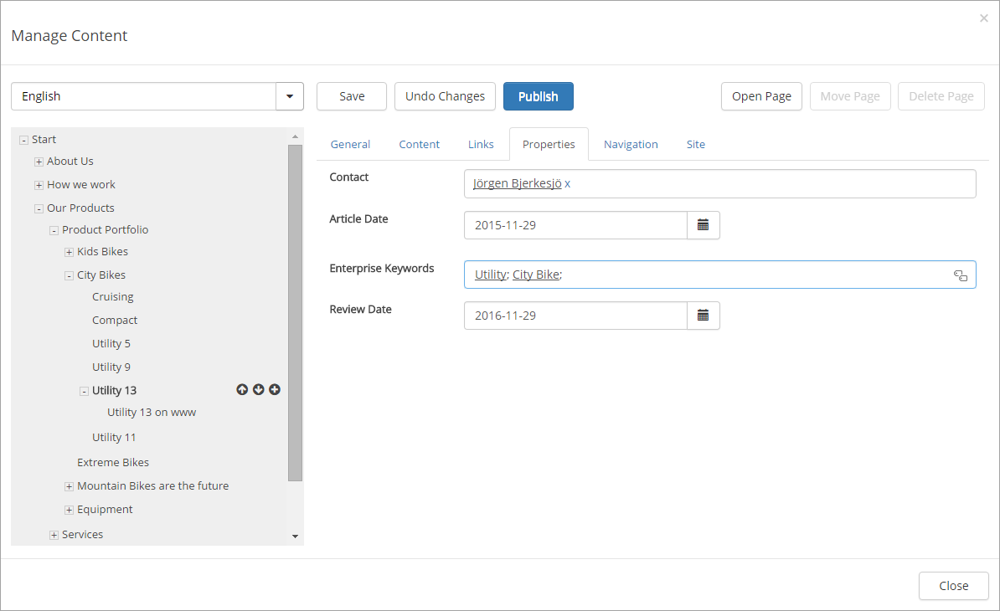

Note! If the field "Review Date" is present, you should normally add a suitable date there. Then the page will be indicated in "Content Management" in Omnia Admin, when the date is passed.

Navigation Tab 
*******************************************
The navigation tab includes all settings related to navigation for the page.

.. image:: navigationtab.png

**Navigation Term title**: By default, the navigation title will be the same as the page title, but it is possible to customize the navigation title. Check the box "Customize" and then change the title. All navigation components will now display this title instead of the page title.
**Friendly Url Segment**: The friendly url to the page is built up of segments from all parent nodes in the navigation. The last segment in the url can be edited. By default it is set to the title, but excluding special characters.
**Navigation Hover Text**: It is also possible to set a hover text. The hover text will appear when the user holds the mouse over the node in the cross-sites-mega-menu and the current navigation.
**Visibility in menus**: Check "Show in Global Navigation Menu" if you want the navigation node to appear in the mega menu. Check "Show in Current Navigation Menu" if you want the navigation node to appear in current navigation on the left-hand side of the page.

Note! The navigation node will always be visible in the breadcrumb.

Site Tab 
******************************
The site tab holds information about the current publishing site. It is possible to navigate to the pages library where the physical page is located.

The site permissions part displays all SharePoint groups that have access to the page. Click on "Edit Permissions" to go to the SharePoint UI and add users to the different groups.

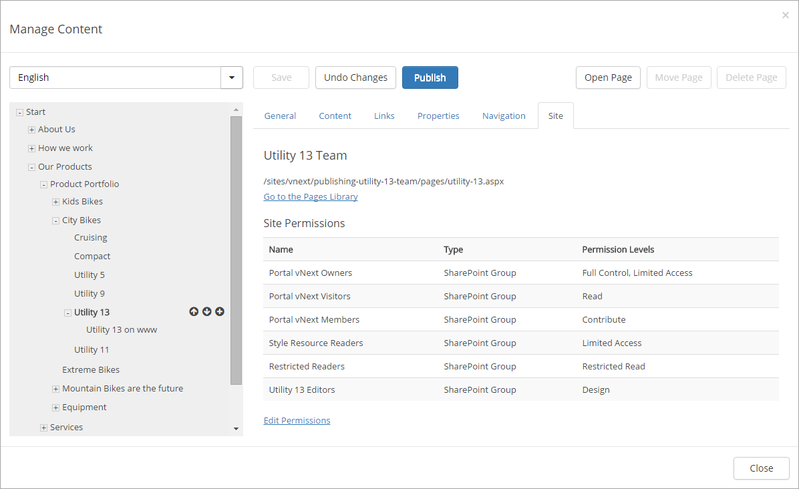

Edit > Save > Publish 
***************************************************
If you open the Manage Content UI by clicking on the "Quick Edit" button on a web page, then it will automatically be checked out and ready for editing.

If you click on a page in the navigation structure in the Manage Content UI and the page is not checked out to you, you need to click on "Edit" to start editing.

.. image:: editbutton.png)

If you click on "Save", all changes will be saved, but the page will still be checked out to you.

If you click on "Undo Changes", any changes made since the last save will be discarded and the page will be checked in.

If you click on "Publish", the page will be published. Note! The page will not be shown in any navigation components until it has been published at least once.

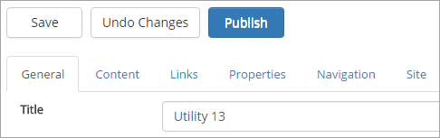

If you want to preview changes before you publish a page, you need to save the changes and then click on "Open Page". The page will now be opened in a separate tab.

Move Page 
*********************************
There are two prerequisites in order to be able to move a page in the navigation structure:

+ The page needs to be checked out. pp
+ The page cannot have any children.

Click on "Move Page" and select a target parent page. If the target parent page is in the same publishing site, the page will be moved to the new location without any further notice. If the target parent page is in another publishing site, there are two options:

+ Keep the physical page in the source publishing site and move the navigation node.
+ Move the physical page to the target publishing site.

Delete Page 
************************************
A prerequisite to be able to delete a page is that it doesn't have any children. Click on "Delete Page" to remove the page together with the navigation node.

Note! In the scenario where several navigation nodes (terms) point to the same physical page, only the navigation node will be removed and the physical page will be kept.

Important!
A deleted page can not be restored by an editor.

Translations
*************
It may be possible to work with the content in several languages. If it is, you can select language while editing a page:

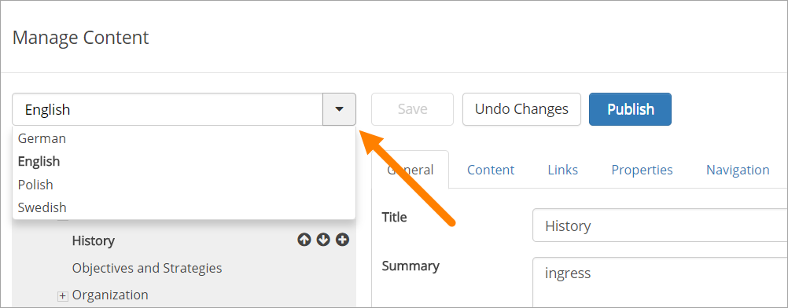

If the page already exists in the selected language, it is displayed and you can continue working on the content.

If the page does not exist in the selected language, you have to create it:

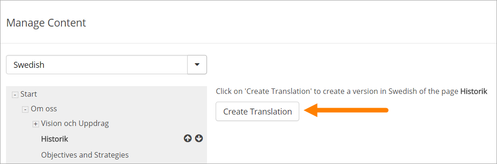

When the page is created, and only then, all content from the master language is copied. After that, the language editions of the page are different units, with no connection between them.

You can now edit the language edition of the page the normal way. Note that everything can be "translated", even for example links. You can add new new links and other content if needed.

When you are finished, you publish the language edition the same way as for the master page, but now the button is named "Publish Translation". If something went wrong, you can delete the language edition of the page.

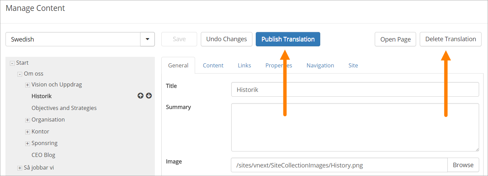

Permissions 
***************************************
To be able to edit or delete a page, you need the appropriate access rights to the physical page in SharePoint. The physical page is located in a publishing site and the permissions to the publishing site can be found on the Sites tab.

To be able to add a new page (or page link) in the navigation structure, you need SharePoint "Add Item" access rights in the publishing site where the parent page is located. Example: You want to create a new page below "Utility 13". You need "Add Item" access rights on the publishing site where the physical page utility-13.aspx is located.

To be able to sort a page, you need edit access rights to the parent page in the navigation structure.

To be able to move a page, you need edit access rights on the publishing site where the target parent page is located.

