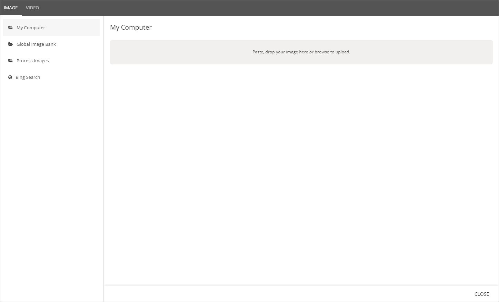
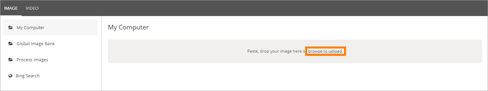
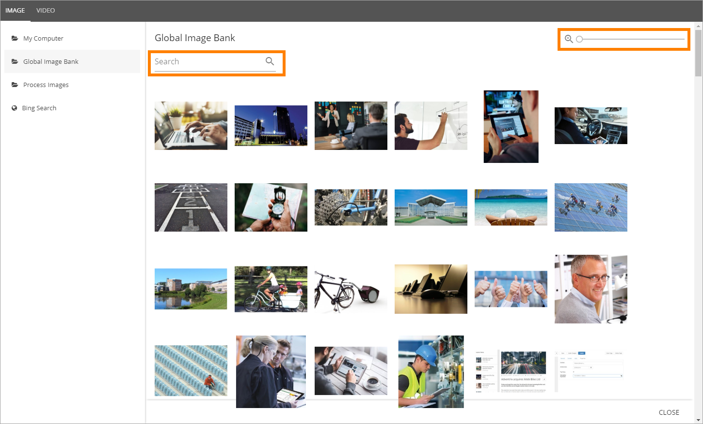
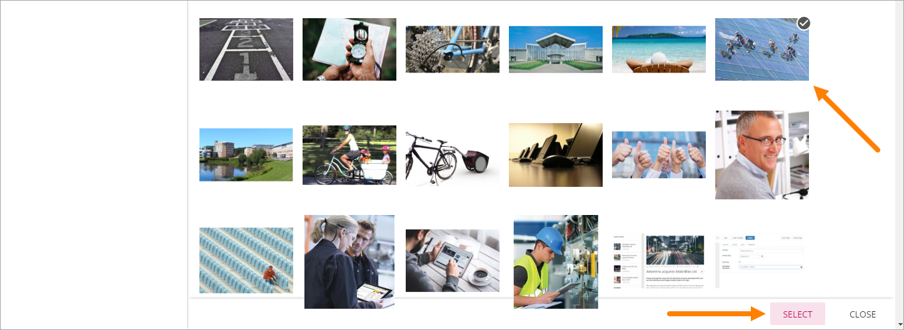
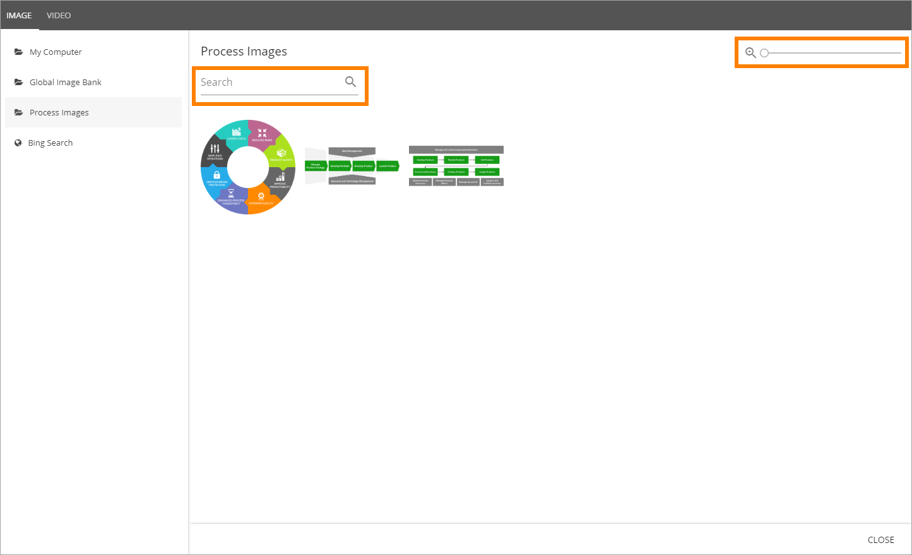
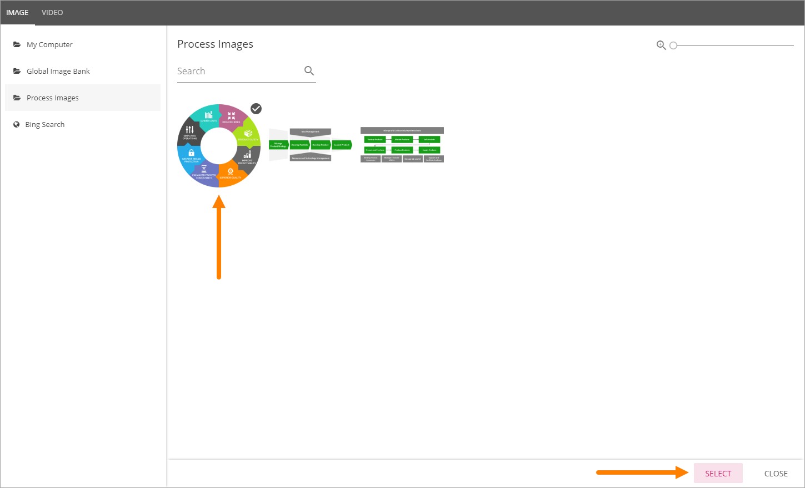

Media Picker
===========================

The Media Picker can be used to add an image or a video to the page image area. Any image on the editor's computer can be selected, as well as from any central image location registered in Omnia Admin. An image can be pasted from the clipboard as well. Besides that Bing can be used to find images. Regarding Bing, only images that are free to use and share will be available.

Videos can be selected from your company's Stream in Office 365, or from YouTube.

To use the Media Picker instead of the Image picker, the Media Picker needs to be activated in Omnia Admin (Systems/Settings/Intranet Core).

More information about the Image Picker is found here: (Link)

Here's how to use the Media Picker:

When browsing for a page image using Quick Edit (for publishing pages and news article pages), the Media Picker is opened:

Selecting an image
*******************
The first step is to select an image and then some basic settings can be made, see below.

My Computer
-----------
Select "My Computer" to either paste an image from the clipboard or to browse for an image. 

Global Image Bank
------------------
When selecting "Global Image Bank", you see a preview of all images there. Use "Search" to search for an image. You can use the slider to the top right to change the preview size.

To select an image, double click on the image, or select the image and click "SELECT".

Process images
--------------
If Omnia QMS i installed, an image library for process images will be available. When selecting this option you see a preview of all images there. Use "Search" to search for an image. You can use the slider to the top right to change the preview size.

To select an image, double click on the image, or select the image and click "SELECT".

Bing Search
------------
When selecting "Bing Search" you can search for any Bing image, or use the predefined search categories, if any is set up. Bing search categories can be set in Omnia Admin (Systems/Settings/Media Picker).

