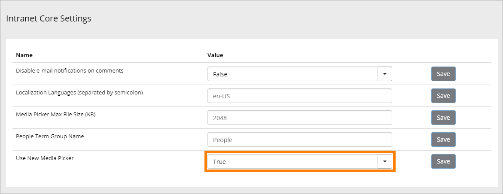
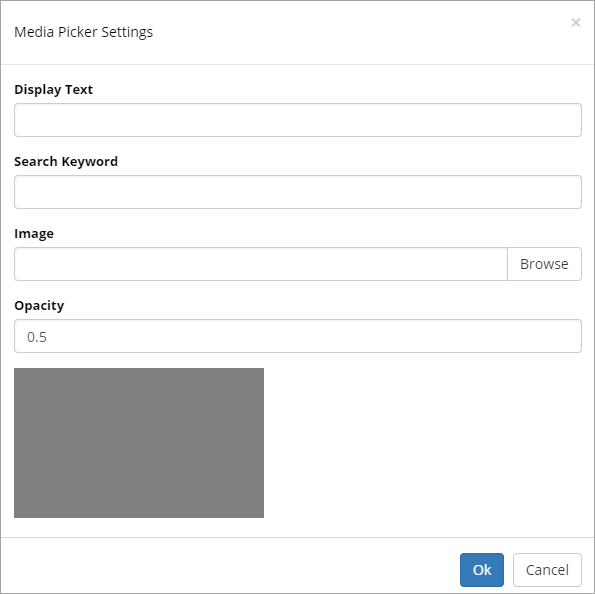
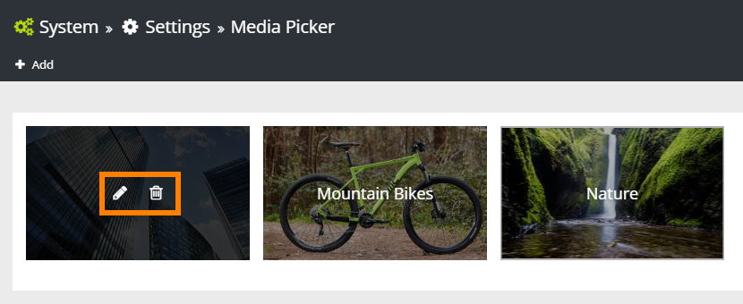

Setup Media Picker
===========================

The Media Picker must be activated to be available. If it's not activated, the Image Picker will be available instead. For the Media Picker you can also choose to set up some predefined Bing Search Categories.

Activate Media Picker
*********************
Here's how to active the Media Picker:

1. Open Omnia Admin and select System/Settings/Intranet Core.
2. Change "Use Media Picker" to "True".

Set up predefined Bing Search categegories
*******************************************
1. Open Omnia Admin and select System/Settings/Media Picker.
2. Click "Add".

+ **Display text**: Add the "Heading" for the catagory.
+ **Search Keyword**: Add the search keyword to be executed.
+ **Image**: Add an image to represent the category.
+ **Opacity**: Some opacity is needed to show the text on the image. Yo can change opacity here.

To edit or delete a category, point at the category and select the pen or the waste bin respectively.

