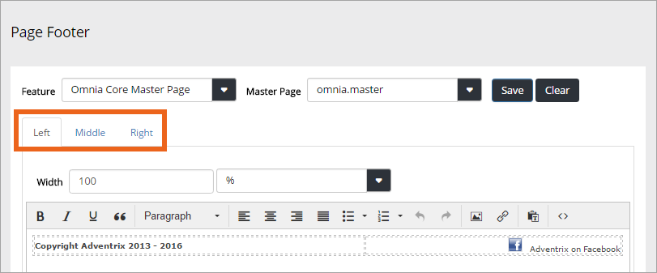
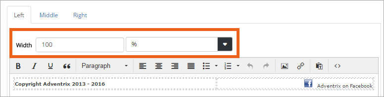
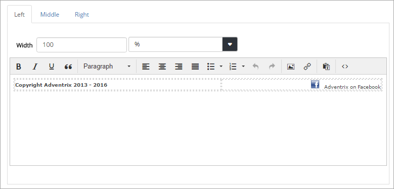
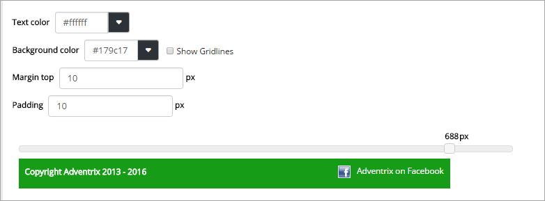
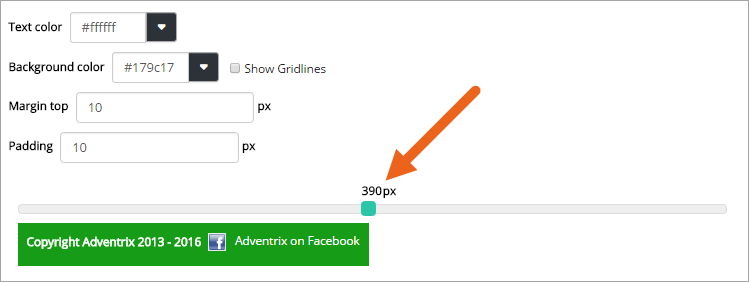
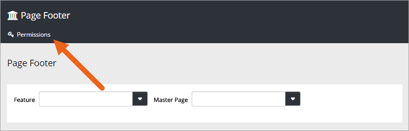

Page Footer
===========================

.. toctree::
   :titlesonly:

   setup/index

Use this option to place and edit a footer on all pages in Omnia that uses a certain Master Page.

1. Select Feature.
2. Then select Master Page.

You can add content for three footer positions. Use the tabs do do that.

The three tabs work the same way. You of course don't have to use all three positions. Using just the "Left" tab and instead using tab positions or a table, could also work.

Use "Widths" to set the width for each position (Left, Middle, Right). Set the width in pixels using the left field, or as a percentage, using the right field.

Use the content area to add text, images or links.

You can set Text color, Background color, Margin and Padding for the footer. Below these setting you can see a preview.

The margin is space between the footer and the main part of the page. Padding is top and bottom spacing within the footer.

You can also use the preview at the bottom to see what the footer will like in different window widths, for example on mobile devices. Just "grab" the handle and slide to the width you wish to preview.

Don't forget to save your changes.

Page Footer Permissions
************************
You need to be Global Admin to use this option. If any other users should be able to work with Page Footers, click "Permissions" and add them.

