Page Layouts
===========================

An administrator or an editor with the correct permissions can work with Page Layouts. The prerequisite is that the page is a **Quick Page**. 

You can't use this kind of Page Layout on a standard Sharepoint Page - a page where "Enable legacy web parts" is on.

There are two levels which will normally need different permissions:

+ Layout Designer: Normally used by an administrator, to create layouts to be used in Page Designer.
+ Page Designer: Normally used by an administrator or an editor to place controls (blocks) in the layout. A block can for example be Page Contents, Related Links or a Banner. For more information on Page Designer, see below.

Besides that, there are settings in Omnia Admin.

The Layout Designer, The Omnia Admin settings and the Page Designer are all descirbed here, and in that order. See the corresponding sections below.

The Layout Designer
***************
Layout Designer is used to create layouts to be used in Page Designer

Working with Layout Designer
--------------------------------
Do the following:

1. Go the page you will be working on.
2. Open the administration menu.
3. Select "Edit page".

If you have the correct permissions something like this will be shown:

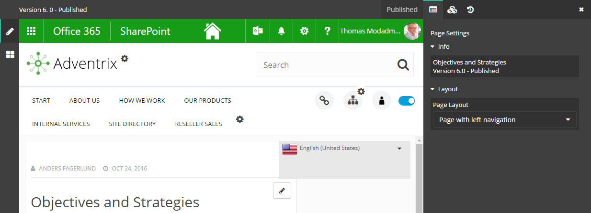

4. Click the "Layout Designer" icon (if it's not shown, you don't have the correct permissions).

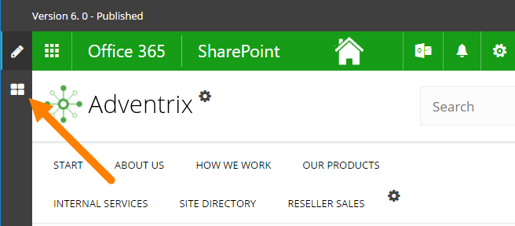

You can now select Page Layout for the page, edit the Page Layout or create a new Page Layout.

Selecting a Page Layout
------------------------
To select a Page Layout, do the following:

1. Open the list "Layout" and select a layout.

.. image:: select-page-layout-new.png

If more than one Page Layout is available, you can change Page Layout for a page this way. You must publish to apply the layout change.

**Note!** If blocks already are added to the page, they will normally realign to the new layout. If that is not possible, all blocks will be placed in one single Zone. You then have to drag the blocks to the correct Zones.

Editing a Page Layout
------------------------
To edit a Page Layout, do the following:

1. Select layout.

**Note!** You can only edit Page Layouts created by you or another administrator. Layouts that are implemented when the Intranet is installed can't be edited (but can be selected).

Something like this is shown:

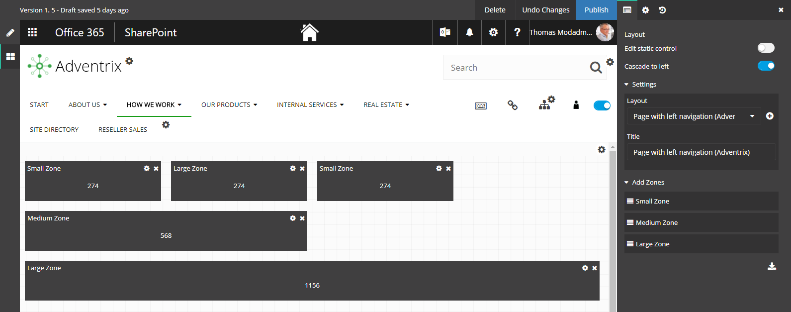

You can now add, edit or delete Zones. You must publish to apply the changes.

When you edit an existing layout you can choose to save your edited layout as a new template, see below. You don't have to publish to be able to do that.

Creating a new Page Layout
---------------------------
To create a new Page Layout, do the following:

1. Click the plus.

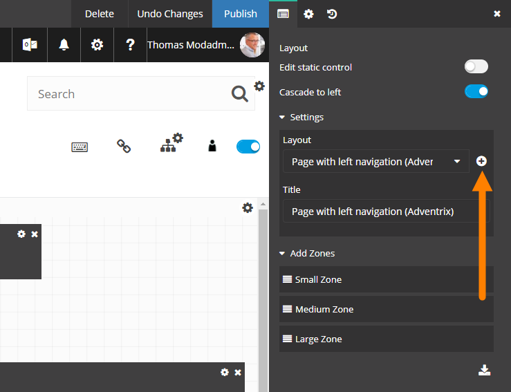

2. Add a title for the new layout.
3. Click "Save".

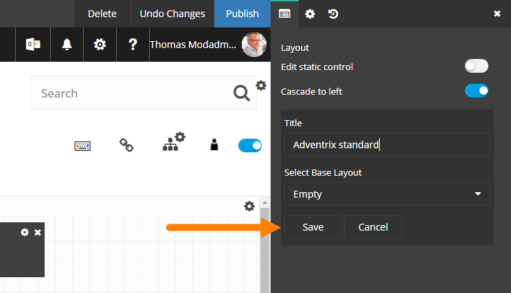

4. Edit the new layout by adding, deleting or editing Zones.
5. Publish to apply the changes to the Page Layout.

**Note!** When you publish, the selected page layout will be applied for the active page.

Edit static control and Cascade to left
----------------------------------------
When you edit a layout there can be static controls, that can't be edited or moved by the editor. As default they are not shown. If you want to see where they are, click "Edit static control".

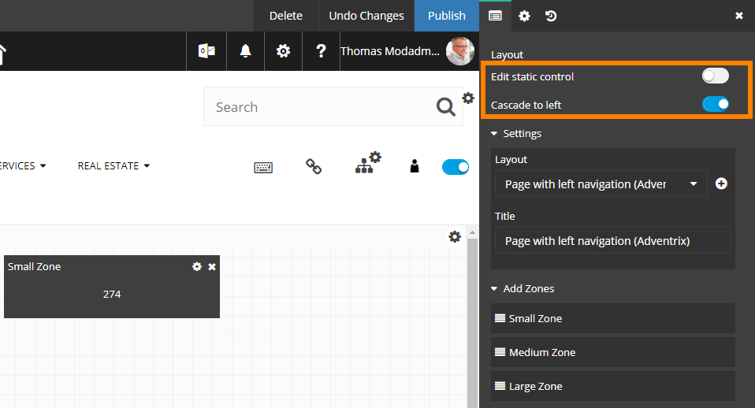

When you add a new control, it is, per default, aligned (cascaded) to the left. If you don't want that, click "Cascade to left" to deselect that option.

Delete, Undo Changes and Publish
---------------------------------
You can delete a Page Layout, undo the changes you have made and publish the changes, by using the buttons at the top:

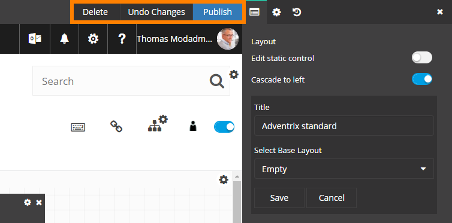

Save as a new template
------------------------
When you have made all the changes, you can choose to save the layout as new layout template (base layout). You don't have to publish to be able to do that.

1. Add a new name for the layout and then click "Save".

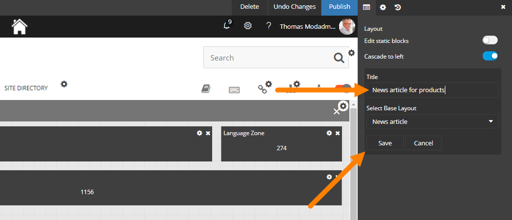

You can continue working on the page, adding blocks and so fort, and publish when you are done.

Version History for Page Layouts
---------------------------------
When you do any change to a Page Layout, a Version History node is created. You can use the Version History to go back to any earlier edition of the Page Layout.

Published editions are noted with an integer, work in progress with a decimal.

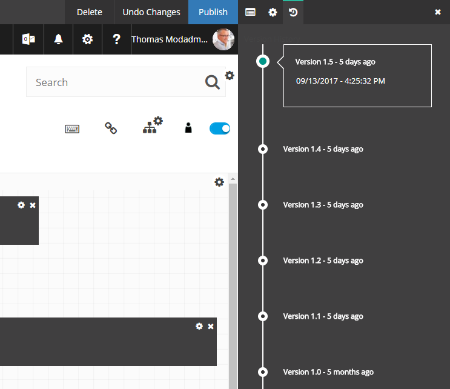

Settings in Omnia Admin
***********************
Using the settings in Omnia Admin, an administrator can select the Page Layouts that should be avalaible for the active Site Collection (applicable for Publishing Sites only).

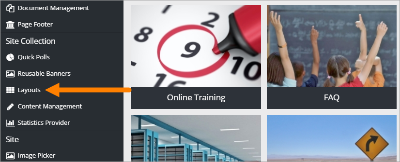

The list of available Layouts is shown, for example:

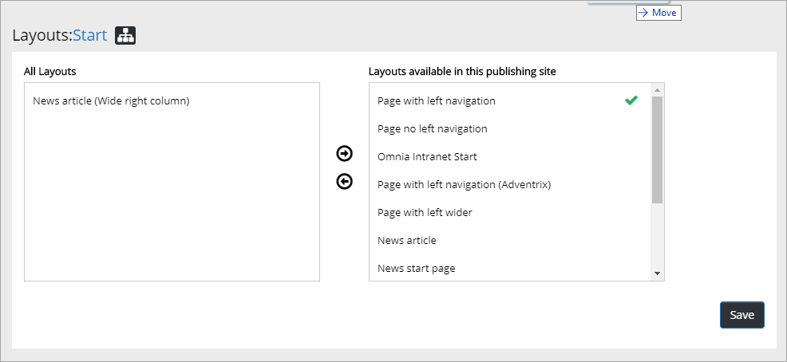

Use the buttons in the middle to move Page Layouts to or from the lists, to decide which layouts should be available here. You can select several by clicking on them, and deselect the same way.

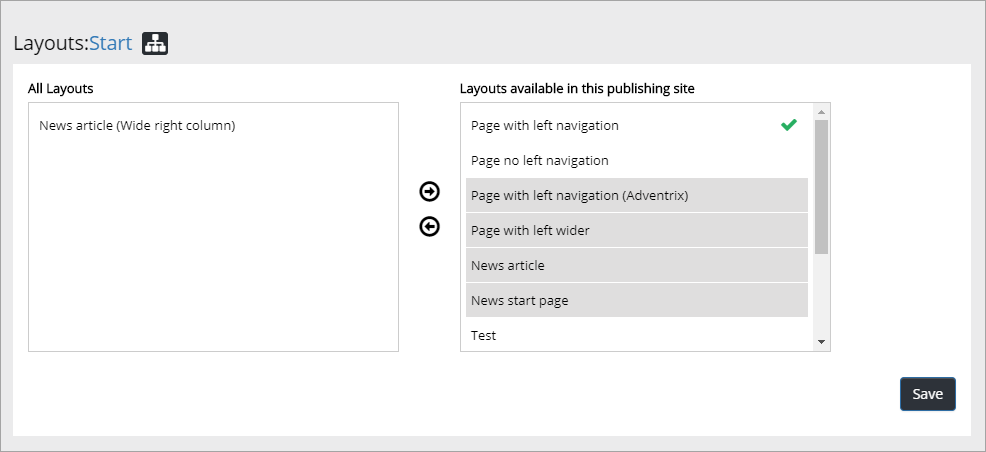

One Page Layout is always Default. It's the one with a green symbol. You can select any other layout as the default by pointing at it and clicking "Default".

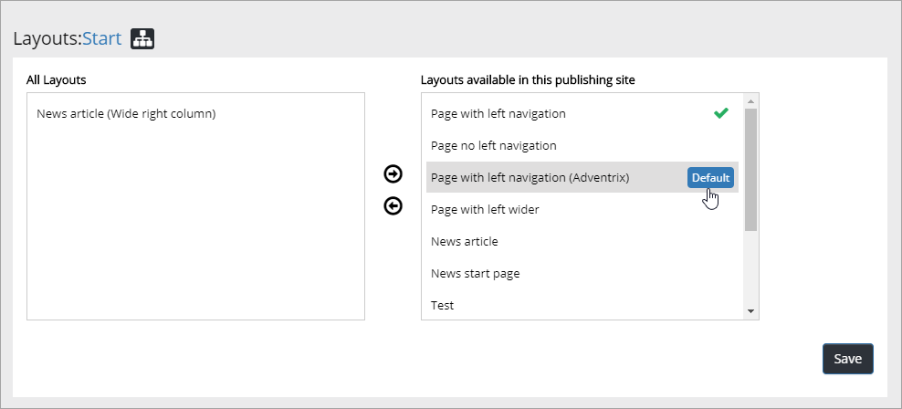

Don't forget to save when you're done with all changes.

Page Designer
**************
Here we will describe Page Designer. For an instruction on how to use Layout Designer, see above.

A very important difference between a Quick Page and a standard Sharepoint is what the editor can see. The end user will always see the same thing: the latest published version.

+ For a standard Sharepoint page an editor will see the latest edited version, regardless of who made the changes, and regardless of wether that version is published or not.
+ For a Quick Page an editor will always see the latest **published** version and must open the page for editing to see the latest edited version.

Selecting another Page Layout
-----------------------------
You can select any available Page Layout for a page and you can add or delete blocks (controls) in the different Zones in a Page Layout.

To select another Page Layout, do the following:

1. Go the page.
2. Open the administration menu.
3. Select "Edit page".

If you have the correct permissions, something like this will be shown:

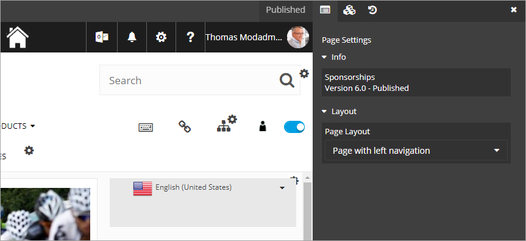

4. Open the "Layout" list and select layout.

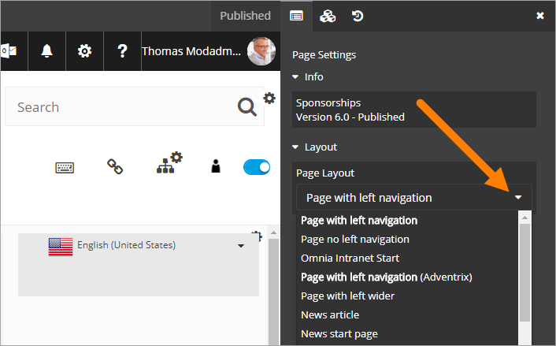

5. Make changes to the blocks, if necessary (see below).
6. Publish the page.

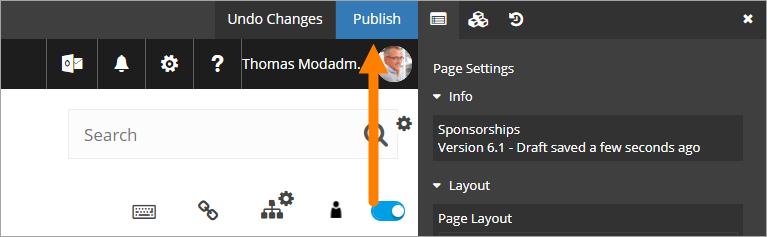

Working with blocks
---------------------
When you have opened a Quick Page to edit the Page Layout, you can work with the blocks as described in this section. Don't forget to publish when you're finished!

Adding a new block
--------------------
To add a new block:

1. Open the Block list.

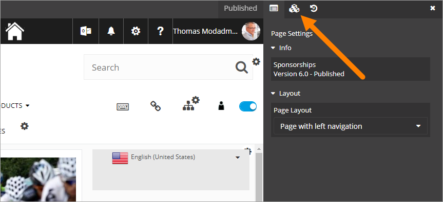

2. Drag the block to a Zone, and to the place you want in the Zone.

When you start dragging you can see where the zones are and which blocks are already in place in a Zone. You can place the new block anywhere withing a Zone, normally both over and under other blocks.

When you drag the new block to a place where it's possible to place it, a dotted line is shown:

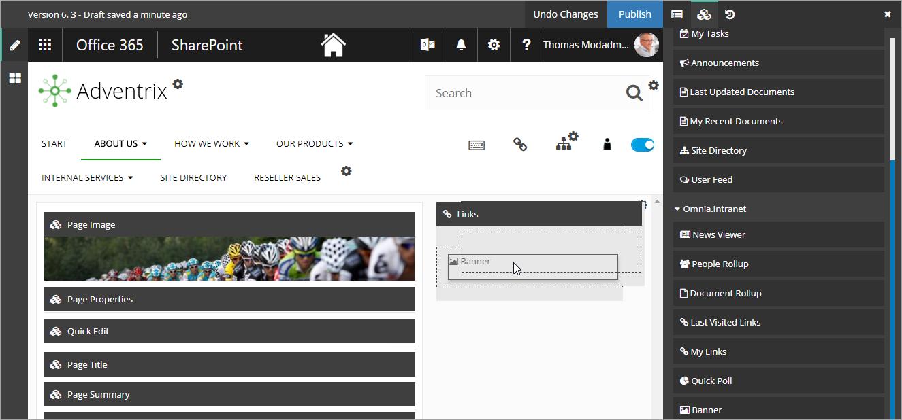

3. Just "drop" the block when you have dragged it where you want it.

Moving a block
-----------------
To move a block:

1. Click on the block you want to move and drag it to the new place. 

When just looking at the page it's not always obvious what is a block and what is not, but when you point at a block a black bar is shown:

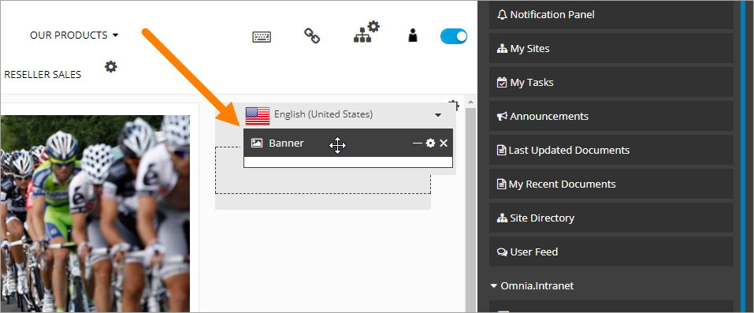

**Note!** Not all blocks can be moved. The layout can contain static blocks and they can not be moved.

Deleting a block
--------------------
If you need to, you can delete a block this way:

1. Point at the block.
2. Click the x.

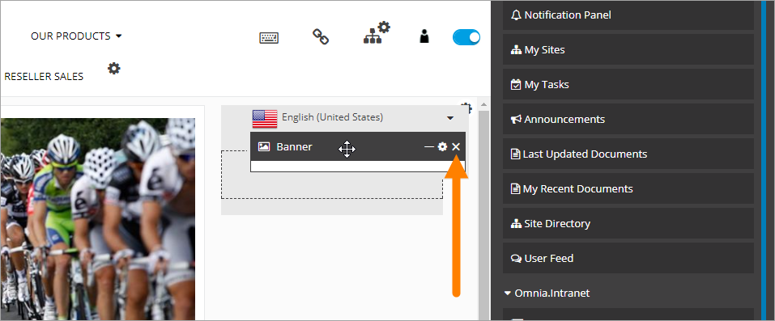

The following is shown:

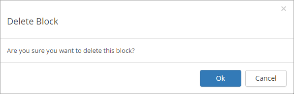

3. Click "OK" if you're sure, "Cancel" if you're not.

**Note!** Not all blocks can be deleted. The layout can contain static blocks and they can not be deleted.

Save, Undo Changes and Publish
--------------------------------
You don't need to save. When you make any change the page layout is automatically saved and a new node in the Version History is created (see below). 

If you don't want to save the changes you have made, you can undo these changes this way:

1. Click "Undo changes".

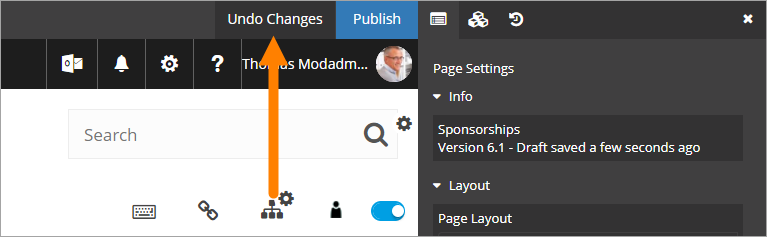

**Note!** When you undo changes ALL changes that are made since the last published version are removed, regardless of who made them.

When it's time to publish the layout changes:

1. Click "Publish".

Version History
--------------------
When you do any change in the layout for a Quick Page, a Version History node is created. You can use the Version History to go back to any earlier version of the layout. You edit the content the normal way.

1. Open "Version History".

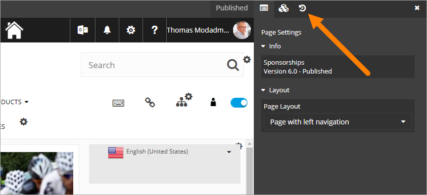

Published versions are noted with an integer, work in progress with a decimal.

2. Select the version you want to go back to, and select "Restore".

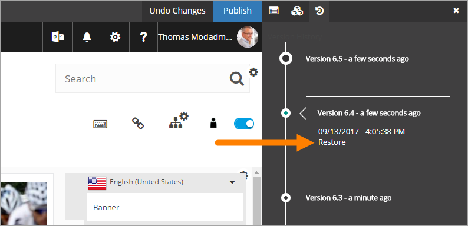

The selected version becomes the latest draft and a new node is created in the Version History. You can now continue working with layout drafts and publish when you're ready.

Editing settings for a control
-------------------------------
What you actually add with a block is a control. To edit the settings for the control:

1. Point at the block so the black header is shown.
2. Click the cogwheel.

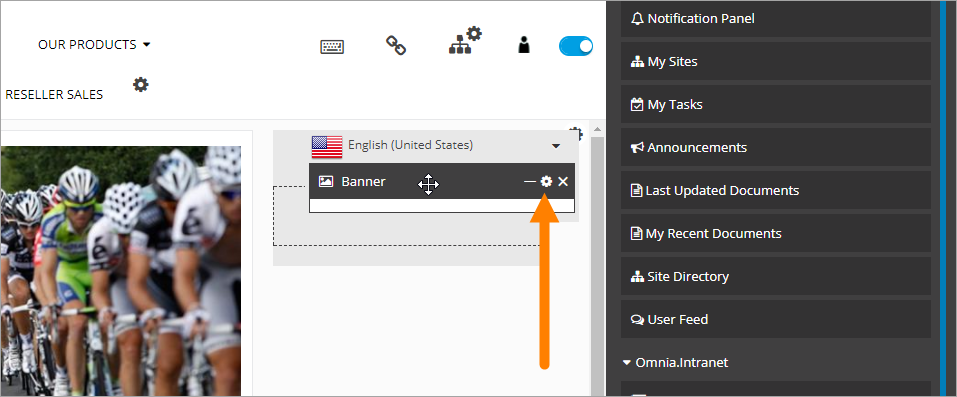

The settings for the control is shown (if any), for example:

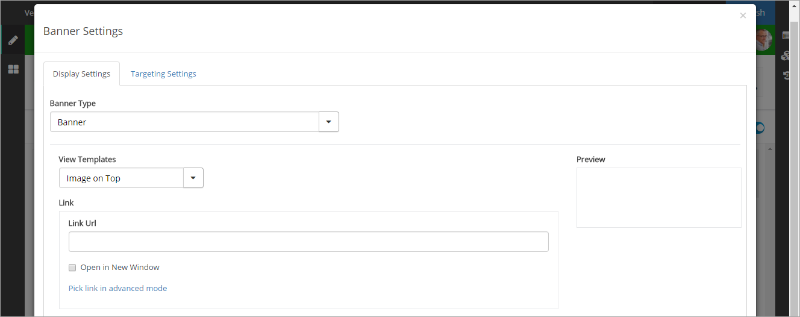

