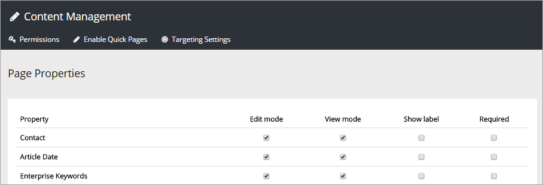

Page Properties
===========================

The Page Properties page will display all list columns in the Pages library of the current site. It supports the following SharePoint data types:

+ Single line of text
+ Date and time
+ Yes/No
+ Person or Group
+ Managed Metadata

The built-in fields Created, Created By, Modified and Modified By is also supported.

+ **Edit Mode**: Check the properties that should be available for an editor in the Manage Content UI.
+ **Group permission**: Use this field to set editor permissions to use the field. A good example is the Top Story field for news: if just a few news editors should be able to publish top stories, enter the applicable user group (which must have been created before you can do this) in the field. Note that it must be a *user group*. You can't add users directly in this field.
+ **View Mode**: Check the properties that should be displayed on the web page, for users. Note that you should use either "View Mode" or "Show More", not both. If you select both, the field will be displayed twice.
+ **Show more**: Select this if you don't want this property to be displayed on the web page directly. When "Show More" is activated, the property is displayed when a user clicks the clink. 
+ **Shared**: Check if the value entered by the author for this property should be shared between language editions of a page. An example: If a contact person is displayed on a page, the same contact for all language editions of a page will be displayed. The editor can not enter different contact persons for different languages. If the editor should be able to enter different values for the property (in the example, different contact persons), this field must not be checked in this settings.
+ **Show Label**: If you want to show the property label in "View Mode" next to the value, this box needs to be checked.
+ **Required** If you select this, an editor must enter information for the property to be able to save a page.

You can use drag and drop to change the sort order.

A tip! Using the field "Review Date" is a convenient way of keeping track of when a page may need to be updated. Any page with a passed Review Date will then be noted on the Content Management start page. For this to work, "Edit mode" must be slected here for the field. 

