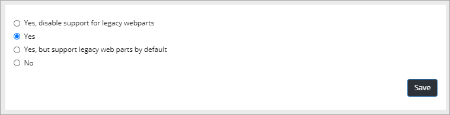
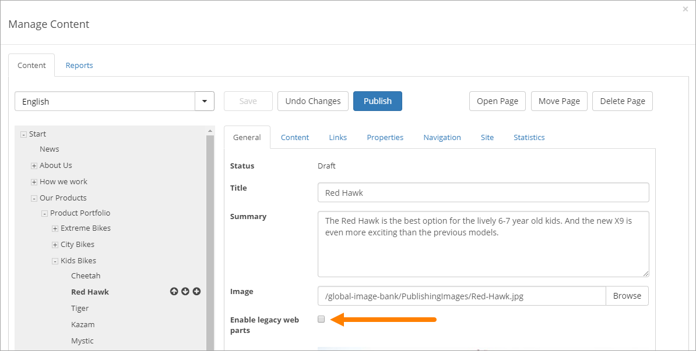

Quick Pages
===========================

Quick Pages will load much faster (it's really a huge difference!). Quick pages has no support for traditional Sharepoint web parts. Only Quick Edit is available for a Quick Page, the Sharepoint mode "Advanced mode" is not available for such a page. 

When Quick Pages is enabled for a site (yes, you activate Quick Pages per site), there can be a checkbox available for the page editor that can be used to decide to use Quick Pages or not for each page in the site.

To enable Quick Pages, do the following:

1. See to that the correct site is the actual site.
2. Open Omnia Admin and go to "Content Management".
3. Click "Enable Quick Pages".
4. Select option here:

Use the settings this way:

+ **Yes, disable support for legacy webparts**: Support for legacy webparts is disabled completely, all pages are Quick Pages. No checkbox is shown for the author.
+ **Yes**: Support for legacy webparts is enabled. A checkbox is shown, but is not selected by default, meaning all pages are Quick Pages by default.
+ **Yes, but support legacy webparts by default**: Support for legacy webparts is enabled. A checkbox is shown, and is selected by default, meaning an author has to deselect the checkbox to make a page into a Quick Page.
+ **No**: Quick Pages is not used, all pages are legacy pages. A checkbox is not shown.

If a checkbox will be shown, the editor will find it here:

In this example Quick Pages is on for this page as enabling legacy web parts is not activated.

How to work with Quick Pages is described on the page "Manage Content", see: :doc:`Manage Content </web-content-management/web-pages/manage-content/index>`
