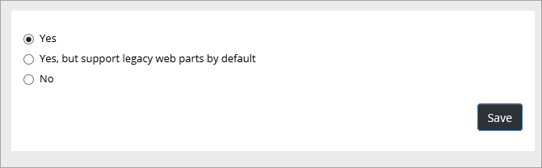
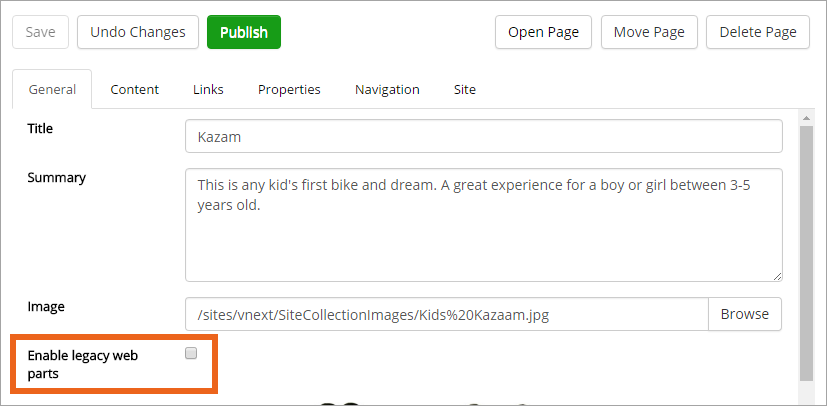

Quick Pages
===========================

Quick Pages will load much faster (it's really a huge difference!). Quick pages has no support for traditional Sharepoint web parts. Only Quick Edit is available for a Quick Page, the Sharepoint mode "Advanced mode" is not available for such a page. 

When Quick Pages is enabled for a site (yes, you activate Quick Pages per site) an editor can then decide to use Quick Pages or not for each page in the site, through a simple checkbox.

To enable Quick Pages, do the following:

1. See to that the correct site is the actual site.
2. Open Omnia Admin and go to "Content Management".
2. Click "Enable Quick Pages".
3. Select option here:

The difference between the first two options is the checkbox the editor will use, if it's checked by default or not. If you would like Quick Pages to always be active, unless an editor turns it off for a page, select "checked by default".

The editor will find the checkbox here:

In this example Quick Pages is on for this page as enabling legacy web parts is not activated.

How to work with Quick Pages is described in "Content Management" (link) here.

bla

