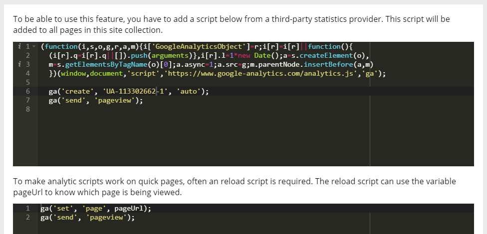

Setup Third-party Statistics
=============================

1. Create a new Account in Google Analytics. Register the tenant root url as site address.
2. Copy the Account Id to Notepad for later use.
3. Go to Omnia Admin > Features.
4. Activate the tenant scoped feature “Omnia Statistics Provider Core”.
5. Go to Statistics Provider and put in the Google Analytics script referencing your Account Id.

Script 1

.. code-block:: none

   (function(i,s,o,g,r,a,m){i['GoogleAnalyticsObject']=r;i[r]=i[r]||function(){(i[r].q=i[r].q||[]).push(arguments)},i[r].l=1*new Date();a=s.createElement(o),m=s.getElementsByTagName(o)[0];a.async=1;a.src=g;m.parentNode.insertBefore(a,m)})(window,document,'script','https://www.google-analytics.com/analytics.js','ga');
   ga('create', 'UA-[Put in your account Id]-1', 'auto');
   ga('send', 'pageview');

Script 2

.. code-block:: none

   ga('set', 'page', pageUrl);
   ga('send', 'pageview');

