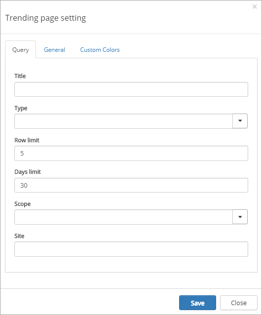
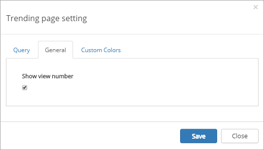
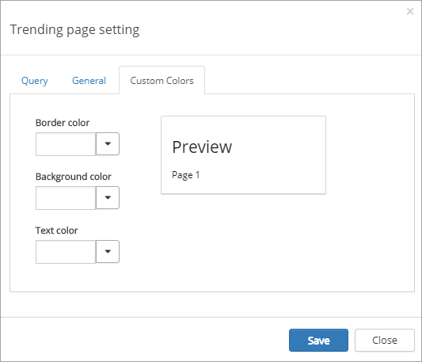

Trending Pages
===========================

.. toctree::
   :titlesonly:

   setup/index

You can use the Trending pages control to display Most liked pages, Most viewed pages or Most commented pages.

The control can be used on any publishing page and is available as a block for Quick Pages or as a web part, and you can of course use several instances of this control on a page.

Settings for the control
*************************
The settings consists of three tabs:

The Query tab
---------------
On this tab the following settings are available:

+ **Title**: Enter the title to be displayed for the control.
+ **Type**: Select type of list - Most commented, Most liked or Most viewed.
+ **Row limit**: Enter number of rows for each "page" in the list.
+ **Days limit**: Select number of days for the query.
+ **Scope**: Select scope - Tenant, Site Collection or Site. 
+ **Site**: When you select "Site Collection" or "Site" above, a site address is displayed here. You can add another site address if needed. 

The General tab
----------------
On this tab you can select to show number of views or not.

The Custom colors tab
------------------------
You should primarily set colors through Theme colors in Omnia Admin (System/Settings/Default colors). If you still would like custom colors for the control, you can set them using this tab.

