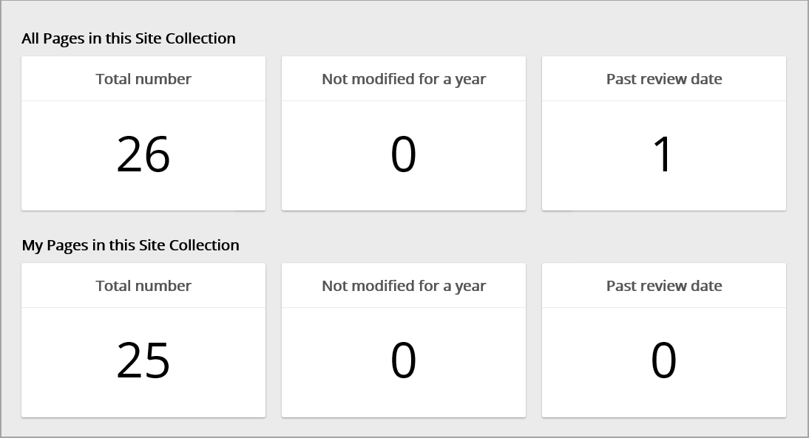
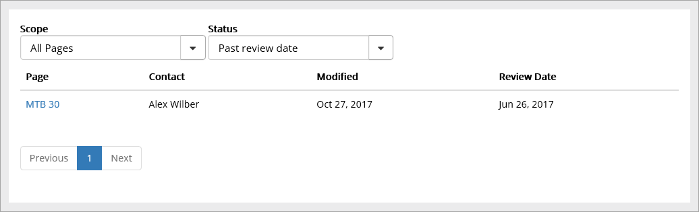
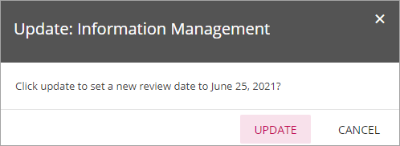
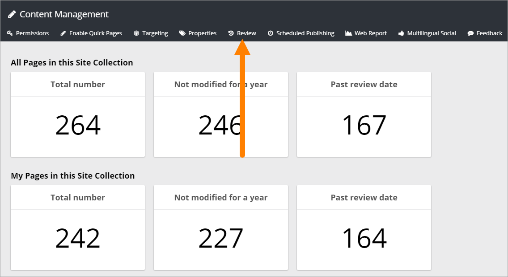
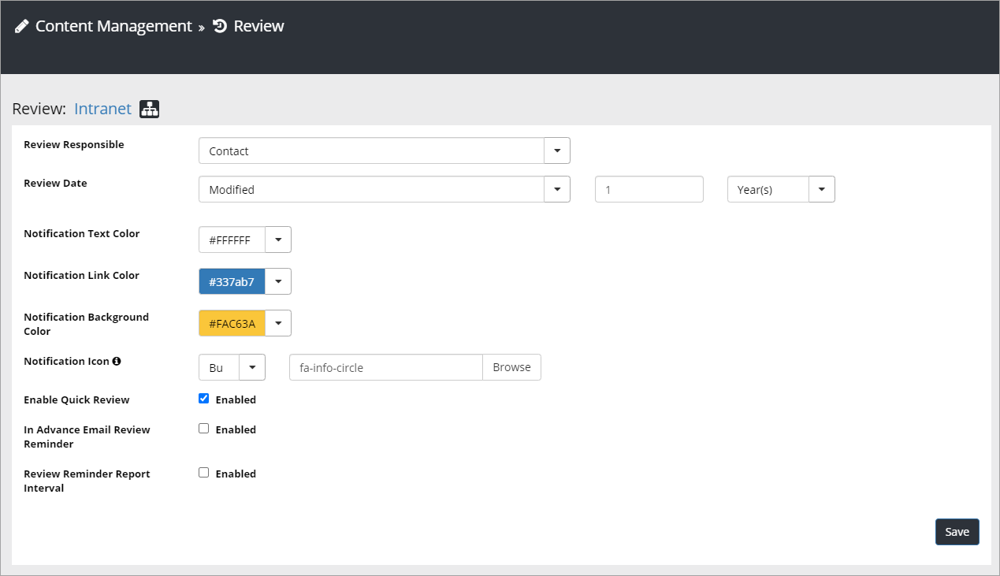

Web Editor Reports
===========================

When "Content Management" is selected in Omnia Admin, the first page displays an overview over the pages in the Site Collection. Here's an example:

Note the two units "Past review date", one for "your" pages, and one for all other pages. Your pages are all pages where you are the contact person (your name is added in the field "Contact"). By clicking the unit you can see a list of the pages in question. You can even click the link to the page to go there. The field "Review Date" must be activated in "Page Properties" in "Edit Mode" for this to work.

Click for more details. Here's an example from a Past review date report:

**Tip!**: There's also a number of reports available for publishing pages, when you edit a page, see (under "Reports, almost at the end of the page): :doc:`Manage Content </web-content-management/web-pages/manage-content/index>`

Page Review
*************
When a page is past it's review date, something like the following is shown for editors (not to users reading the page):

If the page is ok the editor can directly update the review date, by clicking "here" (if the option os activated in Omnia Admin, see below), and then the following is shown:

Suggested review date depends on settings in Omnia Admin, see below.

The editor can just click "Update" and it's done!

Page Review settings
----------------------
Under "Content Managament" in Omnia Admin, an administrator can handle a number of settings for page review. Note that these setting are set per site collection.

The settings are available here:

The following can be set:

+ **Review Responsible**: Select property in the list. The Review Resonsible is notified by an e-mail when the review date is passed.
+ **Review Date**: First select property that the date will be counted on, then set interval - number of days, months or years.
+ **Notification Color**: Set the color for the text, link and background for the notificiation on the page (see above for an example).
+ **You can also select an icon for the notification - Built in or Custom, and then select icon. If you select "Custom", you can choose any image as icon. 
+ **Enable Quick Review**: Select to enable Quick Review or not. If Quick Review is active, the link "here" is shown in the notification (see above) so the editor can change review directly. If this option is not active the notification is slightly different. See below for an example.
+ **In Advance Email Review Reminder**: Select this option if the review responsible should be notified before review date has passed, and then set the number of days.
+ **Review Reminder Report Interval**: Here you can set the number of days, months or years for interval in the Review Reminder report.

The review notification on the page can look like this when Enable Quick Review is NOT active:

Note the link to the review responsible instead of the "here" link.